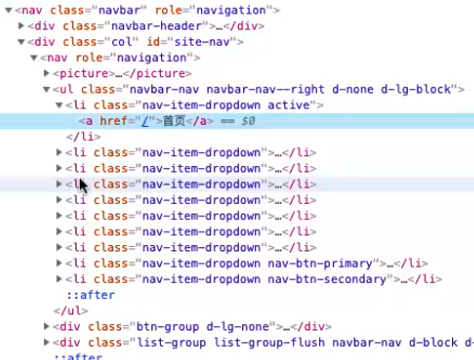
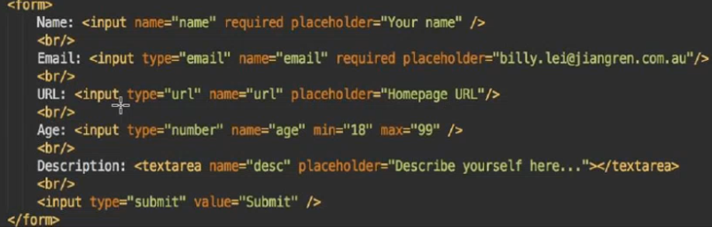
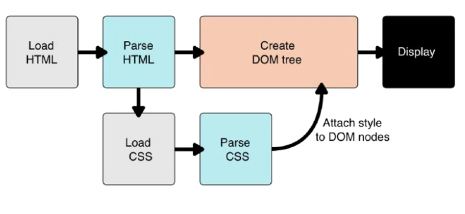
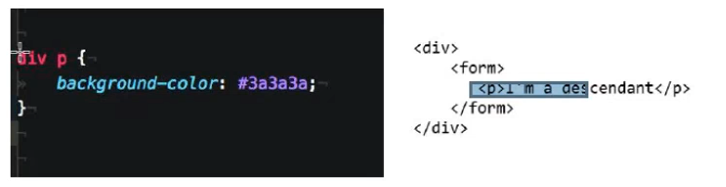
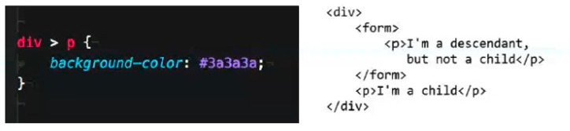
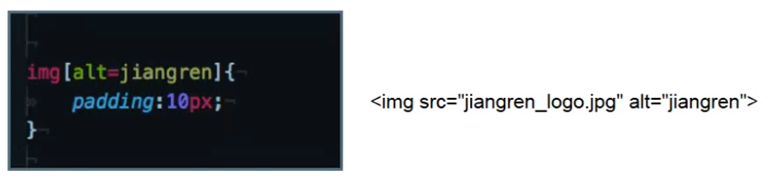
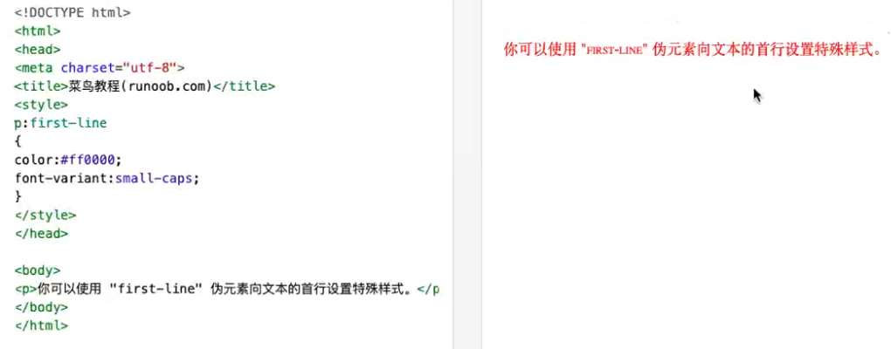
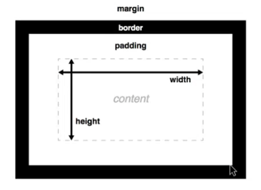
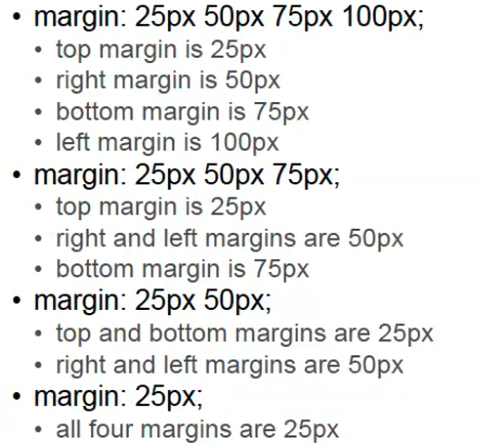

# Class-02 HTML&CSS

## 主要知识点
  - [1.个人介绍：Gary老师](#1个人介绍gary老师)
    - [1.1 html, css, javascript](#11-html-css-javascript)
      - [1.1.1 web运行原理](#111-web运行原理)
      - [1.1.2 HTML](#112-html)
      - [1.1.3 CSS](#113-css)
      - [1.1.4 Javascript](#114-javascript)
      - [1.1.5 总结](#115-总结)
  - [2.HTML](#2html)
    - [2.1 HTML 文件结构](#21-html-文件结构)
    - [2.2 HTML head](#22-html-head)
      - [2.2.1 ```<meta>```](#221-meta)
      - [2.2.2 ```<link>```](#222-link)
      - [2.2.1 head总结](#221-head总结)
    - [2.3 HTML body](#23-html-body)
      - [2.3.1 live-server](#231-live-server)
      - [2.3.2 ```<a>```](#232-a)
      - [2.3.3 ```<h1>```](#233-h1)
      - [2.3.4 ```<p>```](#234-p)
      - [2.3.5 ```<br>```](#235-br)
      - [2.3.6 ```<span>```](#236-span)
      - [2.3.7 ```<ul> <ol> <li>```](#237-ul-ol-li)
      - [2.3.8 ```<table>```](#238-table)
      - [2.3.9 ```<div>```](#239-div)
      - [2.3.10 ``````](#2310-img)
      - [2.3.11 ```<form> <input> <select> <textarea>```](#2311-form-input-select-textarea)
      - [2.3.12 Format element ```<b> <strong> <i> <em> <mark> <small> <del> <ins>```](#2312-format-element-b-strong-i-em-mark-small-del-ins)
    - [2.4 Semantic 语义化：](#24-semantic-语义化)
    - [2.5 Html 5](#25-html-5)
      - [2.5.1 ```<section>```](#251-section)
      - [2.5.2 ```<figure>```](#252-figure)
      - [2.5.3 ```<audio> <video>```](#253-audio-video)
      - [2.5.4 ```<input>```](#254-input)
    - [2.6 block element VS inline element](#26-block-element-vs-inline-element)
      - [2.6.1 block element](#261-block-element)
      - [2.6.2 inline element](#262-inline-element)
    - [2.7 File path](#27-file-path)
    - [2.8	关于Comment](#28关于comment)
    - [2.9 Dev tool（Chrome）：](#29-dev-toolchrome)
    - [2.10 Project 1：](#210-project-1)
    - [2.11 课间答疑：](#211-课间答疑)
    - [2.12 课后知识点：](#212-课后知识点)
      - [2.12.1 学习资源](#2121-学习资源)
      - [2.12.2 Further Readings](#2122-further-readings)
  - [3.CSS](#3css)
    - [3.1 CSS 引入方法:](#31-css-引入方法)
      - [3.1.1 External style:](#311-external-style)
      - [3.1.2 Inline style:](#312-inline-style)
      - [3.1.3 Internal style:](#313-internal-style)
    - [3.2 Selectors:](#32-selectors)
      - [3.2.1	简单选择器](#321简单选择器)
      - [3.2.2	Element Selector](#322element-selector)
      - [3.2.3	其它 Selector](#323其它-selector)
    - [3.3 Box modal:](#33-box-modal)
      - [3.3.1 margin](#331-margin)
      - [3.3.2 border](#332-border)
      - [3.3.3 box-sizing](#333-box-sizing)
    - [3.4 Units:](#34-units)
      - [3.4.1 ```px```](#341-px)
      - [3.4.2 ```em```](#342-em)
      - [3.4.3 ```rem```](#343-rem)
      - [3.4.4 ```%```](#344-)
      - [3.4.5 ```vw vh```](#345-vw-vh)
    - [3.5 Less used property:](#35-less-used-property)
      - [3.5.1 ```word-wrap word-break```](#351-word-wrap-word-break)
      - [3.5.2 ```display```](#352-display)
      - [3.5.3 ```opacity```](#353-opacity)
      - [3.5.4 ```Text-shadow```](#354-text-shadow)
      - [3.5.5 ```cursor```](#355-cursor)
      - [3.5.6 ```text-decoration```](#356-text-decoration)
    - [3.6 Normalize.css:](#36-normalizecss)
    - [3.7 Position](#37-position)
    - [3.8 CSS class命名法 bem](#38-css-class命名法-bem)
    - [3.9	作业：carddesign](#39作业carddesign)
# 课堂笔记

## 1.个人介绍：Gary老师
- 个人经历：10年IT经验，front-end -> backend -> full stack, node -> java, 个人偏喜欢做front-end，更容易看到成品，有成就感；澳洲绝大多数工作都比较横向的（考验知识的广度）
- 个人体会：偏front-end，node上手会快；早晚会学到一门完整的编译型语言，node偏容易上手，java扩展深度较大，大家可以去Linkedin加老师

### 1.1 html, css, javascript
Web 三巨头：html, css, javascript
#### 1.1.1 web运行原理
- app使用流程:下载->安装->运行，web application同样原理，点击url(服务器下载source code)->三巨头开始运行在你的browser上
- 大家回去看视频:https://www.youtube.com/watch?v=z0HN-fG6oT4
- 无论用什么样的框架，framework，最后都会转换成html+css+javascript
#### 1.1.2 HTML
content structure: 页面上的文本内容 + 框架部分，html不是programing language，因为没有逻辑处理功能
#### 1.1.3 CSS
content presentation: 展示装饰（颜色，排版，布局…）
#### 1.1.4 Javascript
content behavior(交互): equal to everything (初期的目的是处理与用户的交互)
#### 1.1.5 总结
- 经验：各自的语言，做各自的事情，不要过多的混杂在一起
- HTML，CSS有历史包袱（93年发明），版本多，兼容有挑战，所以你查属性要去
  - W3Schools: w3schools.com/html/
  - MDN: https://developer.mozilla.org/en-US/

## 2.HTML
HTML基本结构： open + closing tag + content
> vs code里，敲html选择 html5会自动补全代码    
结构性语言，由tag组成，文件格式固定   
!加tab可以自动生成html
### 2.1 HTML 文件结构
-	```<!DOCTYPE html>```: 给浏览器看，标识本身为html文件
-	```<html lang = "en">```
  - Html 本身就是一个tag
  - 澳洲默认为 en
- ```<head>```:主要给浏览器和搜索引擎用，基本不需要更改的
- ```<title>```：网页标题
### 2.2 HTML head
#### 2.2.1 ```<meta>```
```<meta>``` 开头的一般都是做些配置,做SEO
- ```<meta charset = "UTF-8">```： 文字解码方式
- ```<meta name = "viewport" …>```: 标志屏幕上，显示的像素与device之间的比例关系，以决定是否缩放等
- ```<meta http-equiv = …>```:对不同浏览器的兼容支持
  - 不同浏览器对css兼容不同
  - 工作经验：front-end里，2c产品会sharp your skill； 2b产品不太会需要考虑太多，但是少了很多scenario
- ```<meta name = "…"…>:，<meta property= "…"…> ```:meta data, seo相关，搜索引擎会来检索你，想让它看到什么，填进去
#### 2.2.2 ```<link>```
- ```<link rel = "…"…>```: 从其他的file，service拽的资源
  - ```<link rel = "icon" href = "" />```:设定icon
  - ```target = "_blank"```，这个比较常用：_blank, 新开一个tab
  - _self, _parent,_top,framename 用的都比较少
  - frame 用的比较少现在：划出一段frame 运行独立的html，带来的主要问题会混乱你的history，浏览器捕捉不到你的记录；现在用backend来实现的较多
#### 2.2.1 head总结
```<head>```主要功能为帮助加载，告诉搜索引擎检索内容，做一些配置
> 小技巧：vs code里敲h1, 然后按tab，系统会自动补全代码 

### 2.3 HTML body
页面展示，给user看的所有内容  
标签的基本原理和效果要懂，然后可以去查  
使用caniuse.com来查询标签的Browser Compatibility
#### 2.3.1 live-server
运行html时，可以把文件拖到chrome，直接运行 (重要插件要安装)
或者在目录下运行live-server：https://www.npmjs.com/package/live-server
- Live-server install(mac): 
  - npm i live-server -g
  - 移动到当前文件夹: live-server
    - i: install
    - g: global

#### 2.3.2 ```<a>```
超链接
- link, inline element不会自动换行
#### 2.3.3 ```<h1>```
标题
- 从大（h1）到小（h2..）, 本质是从最外层的title开始，层级递减
- 有层级关系，需要依次使用，不能挑选使用，搜索引擎SEO会注重这一点
- 不是针对ui appearance选择，而是根据结构选择
- 每个网址只能有一个h1
>	小经验：H1, H2, H3, H4, H5, H6只能依次使用，如果跳用，比如只用H1, H4, accessability test 可能fail
#### 2.3.4 ```<p>```
Paragraph 很常用, 
- ```<p>```段落换行：p里加```<br>```; 或者分p
#### 2.3.5 ```<br>```
换行
> ```<br />``` 自闭合，写法比```<br>```更规范
#### 2.3.6 ```<span>```
一般用来圈定一部分要设定的内容,再用css添加效果，本身不带有style
#### 2.3.7 ```<ul> <ol> <li>```
list标签。ul (unsorted list) ol (ordered list)。会在navigation bar中使用

- ul 非常常用，常被用来navigation bar
#### 2.3.8 ```<table>```
- ```<tr>``` table row 按照横行写
- ```<th>```: table header 字体会加粗
- ```<td>```: table data
- 虽然现在component用的较多，但是表格的书写形式还是按行书写
#### 2.3.9 ```<div>```
default block element
- 先问自己想写的是什么，div是一个默认的选择
- 容易被滥用
#### 2.3.10 ``````
标签包含以下参数
- src：来源
- alt: 图片描述，img加载不出来，告诉它这个图片是干嘛的, accessibility强调的一点, 对SEO也有好处.
#### 2.3.11 ```<form> <input> <select> <textarea>```
不再在html中使用，通过JavaScript异步实现
- Form 一般会跟input filed， input + type + name
- 一个input 一般会跟label + input field
#### 2.3.12 Format element ```<b> <strong> <i> <em> <mark> <small> <del> <ins>```
格式调整，但大多标签最好不使用，因为在不同浏览器中可能有不同效果，因此要用css实现。现在开发原则主要把styling放到css里。
- ```<strong> <small>```:设定文本权重高低， 比较常用, ```<strong>```用的最多

### 2.4 Semantic 语义化：
html受众有三个：
- User: 对代码编译后展示的页面，有直接感受 e.g. h tag给用户最直接的感受就是title字体的大小变化
- 浏览器：对代码的解析，e.g. h tag给浏览器的是不同层级title的设定
- 搜索引擎，根据Semantic给你排名
- 排名影响因素还有loading time,优化可以考虑压缩网页里引用的图片大小,或者减少request(请求)的次数(eg:利用Sprite sheet packer把图片排成一张)

### 2.5 Html 5 
感受下html5的语义化
```html
<section>
  <article>
    <header>
      <h1> Title </h1>
    </header>
    <p>This is paragraph</p>
  </article>
</section>
```
#### 2.5.1 ```<section>```
页面可以分成几个section,下层再细分
#### 2.5.2 ```<figure>```
- img + figcaption描述,  不太常用
- figure套img也比较常用
#### 2.5.3 ```<audio> <video>```
-	浏览器兼容不好，用的比较少，常用的都是嵌套其他技术
- 很少使用通过html做，播放音乐，视频
#### 2.5.4 ```<input>```

- required placeholder：功能为 必填，一定跟submit走才有效
- Type = "email"：自带类型检查
- Type = "date"：浏览器的一致性不一样，一般用component来写

### 2.6 block element VS inline element
#### 2.6.1 block element
有默认宽高，不指定宽高情况下 ，宽默认占满一行
#### 2.6.2 inline element
有宽度（等于文字的宽度），没有默认换行
- div（滥用较多），虽然很多tag实际显示相同，但语义上不同
- 去用一个合乎语义的标签，不要滥用div
> 小经验：澳洲对页面accessibility比较看重（要求tag的使用要合乎语义）
- seo：se会给你排分，滥用tag会降分
- Wikipedia 是html文档做的很标准很规范很好的
- 每一段是一个```<p>```,合乎语义

### 2.7 File path
- ```../```: (相对路径)退到上一层目录
- ```./```: （相对路径）当前目录
- ```/```：（绝对路径）从root目录开始走
- 通常情况下绝对路径用的比较多，相对引用在react里某些场景会更好用，绝对引用一般不容易出错（路径要分清，特别是src里面写对的路径）
- 代码中引用到的文件夹名和文件名不要使用中文,编译转换有时会有问题

### 2.8	关于Comment
- 你会把document写到哪里：真正写的好的代码，因为易读，都能self explained；
- 用comment的原因，是解释为什么这么写（可以写业务逻辑）

### 2.9 Dev tool（Chrome）：
快捷键：cmd+shif+i/ctrl+shift+i
- 直接在调试窗口更改css，以显示效果
- Console: 查报错，也可以直接写代码，比如
```js
document.querySelectorAll("h1")
```
- Sources: 看源文件 
-	Network：看加载过程中的请求和文件
- Performance：看performance，比如页面加载时间
- Memory: 看页面memory使用情况，不常用
- Application：用来看cookie，storage使用情况
- Lighthouse:也是用来做performance，整体的performance，SEO，Accessibility等的分析
- Accessibility
  - devtools axe-core extension，根据分数给网站调优
> 小技巧：可以直接在Dev Tool中看一些源码，借鉴到自己项目

### 2.10 Project 1：
大作业一(前四节课结尾开始)：个人网站 
- 个人网站举例：https://australiaitgroup.github.io/jrprofile/#home
- 学习sample中的基本内容
- 把作业当成技能来学习，用好tutorial，做好assignment
课后看：
https://www.youtube.com/watch?v=tSv2KIF7uE4  
HTML-CSS-DOM 视频解释了html, css, DOM，给了个大致的idea

### 2.11 课间答疑(面试中的code test和interview问题)：
- Q：刚刚问了一个问题，面试的时候除了给code test去了解programming的能力以外，面试的时候当面是怎么去面这个programming skill的呢？
  - A: 现场发题，现场写代码
  - A: 或者针对code test的问题，继续问
  - programing面试一定要和面试官交流，无论是不是pair programming，都要说出自己的思路。

- Q: 你遇到的pair programming 面试多吗
  - A: Senior level都有，

- Q: Html interview question有那些
  - A:问的比较少，semantic（tag）基本少
  - A:可能问到的问题，会混合css，js，react一起让你写，或者HTML5标签的浏览器兼容性如何

### 2.12 课后知识点：
在react里,   
for becomes htmlFor，
class becomes className
#### 2.12.1 学习资源
也可日常查询：MDN, W3schools: 介绍html各种标签
#### 2.12.2 Further Readings
- A guide to flexbox：（assignment2 flexbox card 需参考这网址）
https://css-tricks.com/snippets/css/a-guide-to-flexbox/
- CSS布局：https://zh.learnlayout.com/


## 3.CSS
What is css
- 把html当成一个内容，展示由css来完成  
How it works

- Load html源码->浏览器阅读后形成带层级关系的解析->构成dom node， dom tree
- Parse html 过程中：读取css 源码->attach css style到 找到的html dom node
也是有历史性的语言
### 3.1 CSS 引入方法:
#### 3.1.1 External style:
External style(推荐方式): head里加link标签
#### 3.1.2 Inline style:
Inline style（最不推荐）: 省略了找node的过程，但是非常不推荐，不可复用，无单一性原则
#### 3.1.3 Internal style:
Internal style: 也是不推荐，会让html显得很长

### 3.2 Selectors:
写CSS的时候，表明他要附着在什么上面：
#### 3.2.1	简单选择器
- Class Selector：可复用，可叠加，一般最常用
- Id Selector：只能用在一个element里吗，用一次，所以不是很常用
> 分清楚id, class的区别（面试题）
#### 3.2.2	Element Selector
不常用
#### 3.2.3	其它 Selector	
- Universal Selector
- Descendant Selector: 某个node有grand parent等用

- Child Selector:某个node有parent用

- Attribute Selector: 某个元素在某种attribute下

- Psuedo Selector : 某个node在某种状态情况下的style

- 伪元素Psudeo-elements Selectors：试图用css添加一些html（比如用before, after）
- 组合selector：一般用的比较少，因为要识别很多层级关系，容易出问题
### 3.3 Box modal:
block元素均有box modal;  inline element也可用

#### 3.3.1 margin
margin: 跟外界的距离，border的外面，跟着上和左走; 
-	两个div margin 叠加的时候，系统取中间最大值；e.g.一个margin 50，另一个60，系统会取60
-	简写规则：与padding相同

#### 3.3.2 border		
border: 边框的厚度，颜色
#### 3.3.3 box-sizing	
```box-sizing: border-box```
- 系统会将border跟padding算在 width和height里
> 小技巧，vs code里 想写class，可以直接元素名后面加“.”，然后跟tab
 
### 3.4 Units:
#### 3.4.1 ```px```
px: 用的比较少，因为是绝对单位; 长宽可能会用到
#### 3.4.2 ```em```
em：相对单位，因为等于默认字体大小，所以默认值为16像素；跑到父元素找到的字体大小，有继承关系，如果父元素设置了不同的值，em值就会变得复杂
#### 3.4.3 ```rem```
rem：跑到最外层root去找的字体大小，更常用，总是等于默认字体大小；
- 使用rem, 因为字体大小的基本单位是rem，所以更好比较
#### 3.4.4 ```%```
%：相对单位，相对父元素占比
#### 3.4.5 ```vw vh```
vw,vh: 占据在能看到的视窗大小上的百分比，用的比较少
- vw：viewwidth，视窗宽度
- vh：viewheight，视窗高度
> ```margin: 0 auto```:上下为0，左右自动
-	如果css没有初始化，那么可能浏览器默认的属性会更改vw，vh的显示效果

### 3.5 Less used property:
#### 3.5.1 ```word-wrap word-break```
- word-wrap：div里word自动换行 
- word-break：div里word自动切断换行 
#### 3.5.2 ```display```
display：可以让页面不再显示该元素，同时释放所占空间
- display: block
- display: none
- visibility
#### 3.5.3 ```opacity```
opacity：作业会用，可实现渐变效果(透明度)
#### 3.5.4 ```Text-shadow```
Text-shadow,box-shadow: 负责给字体和box加阴影
#### 3.5.5 ```cursor```
cursor：鼠标指针相关，可以跟伪类搭配使用
#### 3.5.6 ```text-decoration```
text-decoration:作业可能用到。用于设置文本的修饰线外观的（下划线、上划线、贯穿线/删除线 或闪烁）

### 3.6 Normalize.css:
初始化css设定，会在开发中导入，避免出现浏览器差异

### 3.7 Position
一定要 看链接（https://zh.learnlayout.com/）  
并掌握，虽然现在工作中用的不是很多（flexbox用的更多）
- 通过top/bottom, right/left, z-index(数值越高，层级越往上)的value来定位
- absolute:
  - 会释放本身所占的空间
  - 会寻找上层position的element，并根据它的position value为基点进行定位
- fixed: 绝对定位，固定位置
- static：不写position，默认的位置
- relative：针对原来位置，进行偏移
- float：现在用的比较少，原来常用来做图片，文字的漂浮

### 3.8 CSS class命名法 bem（assignment1推荐使用BEM命名伐）
getbem.com
- block__element: e.g.card___title, card__description
- modifier: 元素状态时，对应样式的改变

### 3.9	作业：card design
- Card 圆角
- card 阴影
- 遮罩 渐变
- Svg icon用法
- 只用 basic styling
- 只写一两个就好，固定宽度就好
- 建议全部都写 class

