# Class-03 CSS
## 主要知识点
  - [1.Card样式：](#1card样式)
  - [2.CSS: Styling from top to bottom](#2css-styling-from-top-to-bottom)
  - [3.Specificity优先级](#3specificity优先级)
  - [4.Responsive web design](#4responsive-web-design)
    - [4.1 Responsive web design 朴素的（过去的）做法](#41-responsive-web-design-朴素的过去的做法)
    - [4.2 Set the viewport:](#42-set-the-viewport)
    - [4.3 Responsive web design 现代的实现方式](#43-responsive-web-design-现代的实现方式)
  - [5.CSS library分两种](#5css-library分两种)
  - [6.Library引用](#6library引用)
  - [7.CSS preprocessor(CSS 处理器)：less，sass（scss）](#7css-preprocessorcss-处理器lesssassscss)
    - [7.3 方法复用](#73-方法复用)
    - [7.4 Nesting](#74-nesting)
    - [7.5 其它功能](#75-其它功能)
    - [7.6 作业](#76-作业)
      - [7.6.1 作业参考](#761-作业参考)
  - [8.flexbox](#8flexbox)
    - [8.1 （常用）使block elements同在一行，](#81-常用使block-elements同在一行)
    - [8.2 (不太常用)排序：调节同行block里element的顺序](#82-不太常用排序调节同行block里element的顺序)
    - [8.3（常用）换行：换行同行显示宽度不够时，自动把element拖到下一行：](#83常用换行换行同行显示宽度不够时自动把element拖到下一行)
    - [8.4 ```Flex-flow```](#84-flex-flow)
    - [8.5 (常用)```justify-content```](#85-常用justify-content)
    - [8.6 ```allign-itemst```](#86-allign-itemst)
    - [8.7 Children 属性](#87-children-属性)
  - [9.UI Design的principal：一致性](#9ui-design的principal一致性)
  - [10.作业反馈(13期内容)](#10作业反馈13期内容)
# 课堂笔记：
## 1.Card样式：
- 常见形式：要熟悉它的常用元素，元素名字
- 经验：实际工作中，很多时候不是手画而是使用component library

## 2.CSS: Styling from top to bottom
- 从上往下读，重复的地方，下面的会覆盖，而且不会报错 
- 权重：写在不同地方的css的优先级
  - Least：Default Stylesheet, 浏览器加给他的
  - More weight: User Stylesheet, user可以改变浏览器的数据（中间权重）
  - Most: 自写的(Author Stylesheets),```<link>```, ```@import```: 优先度最高
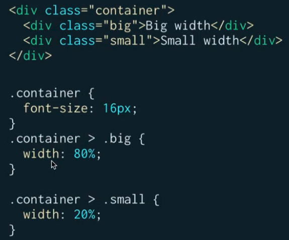
  - 以上为，father是class container的class big和class small加styling,
- BEM用于写css的class name
  - M指的是Modifier：在一定条件下element会变成什么样子
- CSS reset: （可以直接贴过来用）https://meyerweb.com/eric/tools/css/reset/
  - 面试问题：怎么解决不同浏览器之间的显示问题：（cross browser）
    - 可以导入normalize css，reset css
- 不用 universal selector 的好处在于，Reset CSS 能 explicitly reset 特定元素。这样开发能更精准的掌控被重置的元素。

## 3.Specificity优先级
了解一下，不推荐写
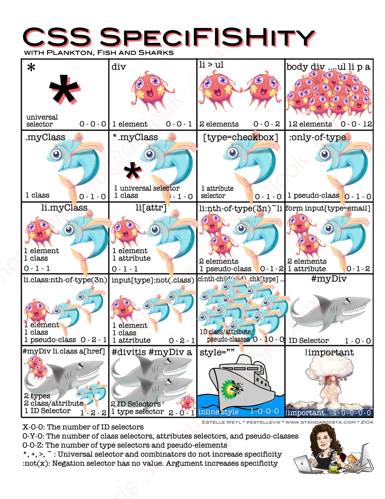
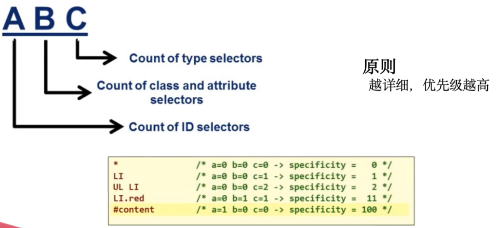
- *最低
- 越详尽优先级越高
- Class,attribute selector高于element
> 现实代码中，避免使用过于复杂的selector, 会极大的降低代码的可读性
- Id优先级更高 
- Inline比id selector更高；dev tools里editior中添加编辑等于直接添加inline style
- !Important: 所标注的selector优先度最高

## 4.Responsive web design
### 4.1 Responsive web design 朴素的（过去的）做法
- 根据不同的device 做出response，令网页适应窗口的变化
> 经验：过去一般用css media query来实现，js的实现方式会比较消耗系统资源；现在一般不太用到，现在使用grid system等来实现，但是底层机制仍然为css media query
- 如何实现：根据窗口的大小，做不同的layout，styling
```css
@media screen and (max-width:600px) {
  //样式放在这里
}
@media screen and (max-width:900px) {
  //样式放在这里
}
``` 
捕捉窗口的变化：css3 media queries
### 4.2 Set the viewport: 
指定屏幕像素与使用device的显示比例
```html
<meta name="viewport" content="width=device-width, initial-scale=1" />
```
- 实际写的css中，屏幕像素不一定与分辨率像素作为1:1关系的，而是与device scale后显示的像素
 
### 4.3 Responsive web design 现代的实现方式
- Grid System(Bootstrap)
  - 基于media query
  - 可以理解为是一个css与javascript的library
  - 提供了各种已经写好的 css class
####	4.3.1 Grid system：
https://getbootstrap.com/docs/4.0/layout/grid/, https://www.bitdegree.org/learn/bootstrap-grid-system
1. 屏幕被分为12个格
2. 根据屏幕不同尺寸，指定div 占几个格
3. 超过12格的会被放到下一行
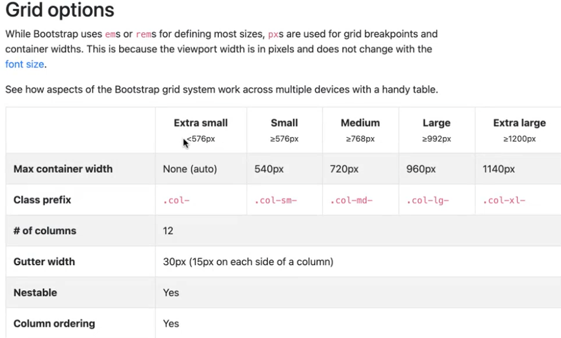   
以上， ```.col-md-8```: 屏幕为medium的时候占8个格
```.col-12 .col-md-8```: 屏幕为medium的时候占8个格，屏幕不断缩小后，将占满12个格   
在不指定large的情况下，md的指定将一直向上沿用
###	4.3.2 CSS grid
与浏览器兼容性不是很好，现在没有大规模在用；现在的排版还是在用各个library的grid system
- meterial-ui grid system：react里最popular的ui
https://material-ui.com/components/grid/
  - 类似于 bootstrap 
  - 基于google的设计语言

## 5.CSS library分两种
一种是有自己的设计语言，然后形成的css
- Ant design：结合react vue来用，不是pure css库
  - https://ant.design/components/overview/
  - component下面会告诉你，是什么，when to use, 什么时候用什么 E.g. Drawer, 
- Zendesk：一家澳洲公司的设计语言 （Garden is the design system by Zendesk https://garden.zendesk.com/）
- Material UI：https://material.io/design
  - 澳洲用的最多
一种是没有自己很浓重的设计语言
- Bootstrap: 也提供了很多常见的components来用
> 注意：就学习阶段来说，bootstrap（一定要看）, AntD, Material UI, 的components 下面一个一个都要看一下 ，知道每个component都是什么，比如啥是breadcrumb(了解网页上的各种元素), https://getbootstrap.com/docs/5.0/components/accordion/  

Grid 一般用于大布局，小组件里position等去定位 (assignment2也可以这么去做)

## 6.Library引用
可以放到自己的cdn去   
CDN:把文件放到文件服务器上，然后通过http的形式访问并放进去，使用cdn时需要注意：
- cdn可以自己掌控
- 地域性，使用户在不同的物理地点，更快的访问文件    
 
CDN: Content delivery network, 属于devops范畴
- 小知识点：npm: 包的管理器

## 7.CSS preprocessor(CSS 处理器)：less，sass（scss）
为什么使用 CSS Preprocessor?
- 可以解决 css 文件复用性不高的问题。
- 提供简单的逻辑计算方程
- 开启了模块化的可能性

Preprocessor 种类:
- Less
- Sass
- PostCSS: 会对编译完成的css再做一次加工，防止出现一些问题
###	7.1 SASS
https://sass-lang.com/guide   
用更新的语言实现css，再编译成css
- 安装方式：```npm install sass -g```
- 对于css的developer不是很友好，需要学习新的语言
- scss: css的super set，包含了css，还加入了一些新的功能
- typescript：对旧语言进行优化
- VS code命令：
  - 新建(terminal命令)：touch e.g. touch index.html
  - 快捷键：
    - control + ~: 打开terminal
    - command + \: 分屏
- scss优势(及如何使用)：
```css
$primary-color: #333;

.container {
  width: 800px;
  background-color: $primary-color;
}
```
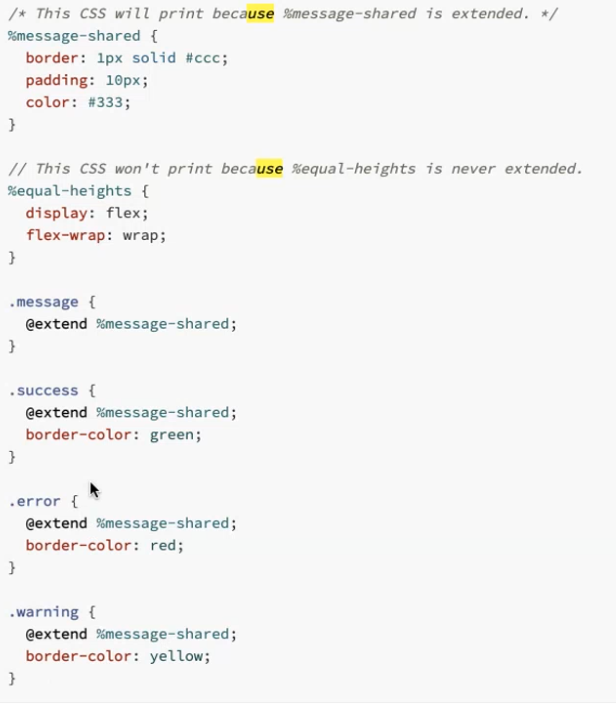
  - 可以复用（引入variables）：用的比较多（上图）
> 招聘上常写：Dry Code：dont repeat yourself
- vs code里敲入```lorem```可以快速填充文字片段
- SASS VS SCSS: sass进一步简化了代码（比如变量定义去掉括号），建议用 scss
> sass xxxx xxxx --watch 会跟随监控你的代码变化，马上编译
###	7.2 Varibles
可以引用：
- 一般放到一个单独的文件里： themes.scss
- css文件里添加：@import 'themes' / @use 'theme'
  - @import 跟 @use 的区别:，经验：建议用use，因为可能会出现重名的情况   
  - Import 导入的变量，使用时直接敲变量名；use导入的变量，使用时要先敲文件名后面加"."再跟变量名
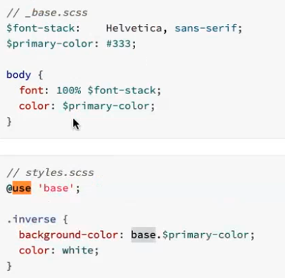

### 7.3 方法复用
方法可以复用：（用的地方不多）
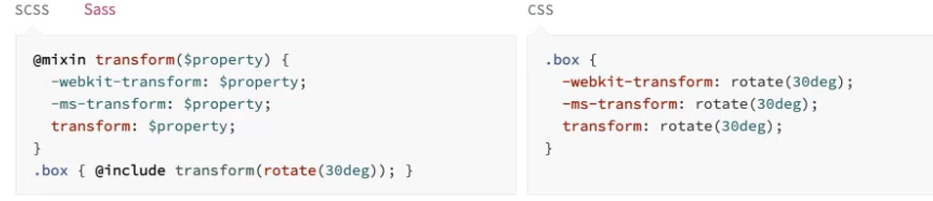	

### 7.4 Nesting
Nesting: 可以更清晰的做出structure，更易读
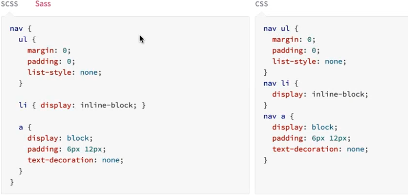	
- selector内的nesting：以前这么写
```css
.container {
  width: 800px
  height: 600px
  background-color: $primary-color;
}

.container__content {
  width: 400px
  height: 300px
  background-color: $primary-color;
}
```
现在scss里要这么写(参考https://css-tricks.com/the-sass-ampersand/)
```css
.container {
  width: 800px
  height: 600px
  background-color: $primary-color;
    &__content {
    width: 400px
    height: 300px
    background-color: $primary-color;
  }
}
```
### 7.5 其它功能
- Mixins
  - 实现基本的复用
- Operator
  - 实现基本的运算
- 具备了基本的方法：
  - 比如颜色浅化```background-color:lighten(#fff, 20%)```


### 7.6 作业
增加写3-5个card
- 引入bootstrap（responsive）/flexbox
- variable, extend 能用就用，clean code
- 能用flexbox可以用flexbox
#### 7.6.1 作业参考
饼哥在tutorial的现场演示如何用flexbox一步步做card design作业：
https://onyx-storm-af0.notion.site/03-Lesson-4-Flexbox-Card-48ff1b7cf17f4b53874ad26b1d65b844

## 8.flexbox
用来解决block element 换行的layout  
https://css-tricks.com/snippets/css/a-guide-to-flexbox/
### 8.1 （常用）使block elements同在一行，
- 添加属性 ```display:flex```;
  - 要控制block的最小宽度：```min-width：100px```
> CSS Secrets: Better Solution 推荐此书
### 8.2 (不太常用)排序：调节同行block里element的顺序
```flex-direction: row-reserse```
- 经验：工作中一般排序用js来处理
### 8.3（常用）换行：换行同行显示宽度不够时，自动把element拖到下一行：
```flex-wrap:wrap```
### 8.4 ```Flex-flow```
不需要看：将换行和排序连起来写
### 8.5 (常用)```justify-content```
调整每行样式
- (常用)```justtify-content:space-between```: 将行内剩余空间平分到elements中间，但是edge边最近的item，距离edge空间几乎为0
- 可以用作导航栏样式，效果如上
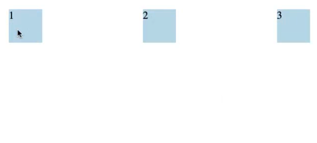	
- ```space-around``` ：每个items两边有相同的空间，但是视觉上item间的距离可能不相同
- ```space-even```：所有的间距（包括item到edge）都相同 
- (常用）```center```：水平居中； css里为 margin: 0 auto
### 8.6 ```allign-itemst```
每行items，距离中轴怎么布局   
```align-content```:不太常用
### 8.7 Children 属性
（经验）通过css自动的计算的，一般不可靠，很少用的上
- 排序：```order```（不太常用，data相关的一般通过javascript处理了）
- ```flex-grow```, ```flex-shrink```的效果参考:
https://codepen.io/enxaneta/full/adLPwv
- ```flex-grow```: 多余的空间，按照grow的值分给每个item
- ```flex-shrink```：数值越大，缩小页面时给出的空间越多
 
## 9.UI Design的principal：一致性
- 一个变量全局控制
- Typography：所有文字类的一个集合
  - 一套ui会规定好了所有可用字体的大小，可选的范围只有这些，不能自定义字体大小
- Color Palette(调色板)
  - Primary colours：网站的主色调
  - Secondary colours：主色调调低
  - Alert colours：跟主色调协调有一致性
- Spacing and positionning
  - 全局的间距标准都是定好的
- Layout:
  - 网站的标准布局（常用设计layout）
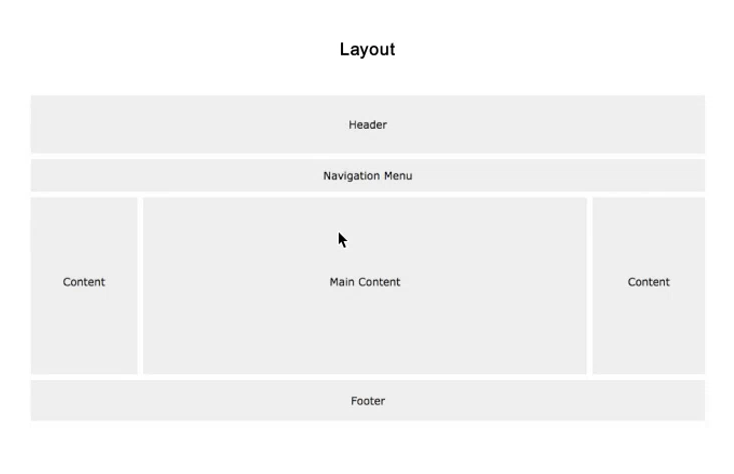
- css建议查阅：https://tailwindcss.com/
- VS Code Extension: 有目的的逐步添加以下extension
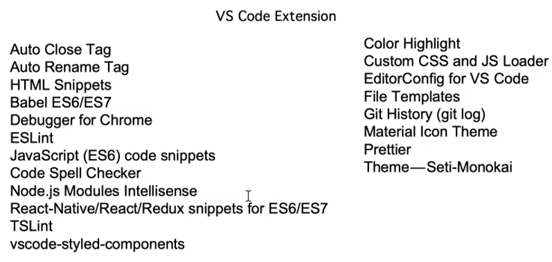

 ## 10.作业反馈(13期内容)
- array摇号操作
  - 浏览器命令
  - ```document.querySelectorAll('li')```
  - ```const names = Array.from(document.querySelectorAll('li'))```
  - ```Math.round(Math.random()*17)```
  - ```Names[Math.round(Math.random()*17)]```
- 作业检查
  - 首先打开看整体，
  - 其次 看html布局，命名有没有用bem
    - 注意：bem里，如果一定要两个单词一起，最好还是单词间加"_" （modifier用于有些许页面交互）
- `````` priority更高一些，并没有突出重点的话，可以做```<background-image>```
> 经验：澳洲面试 横向会做扩展，考验知识的广度
- 注意：h系列千万不要用styling来放，而是根据文本结构使用
- 注意：bem命名：命名为它所代表的一个位置，而不是内容
- svg改色：
  - 情况并不常见
  - ```fill = “red”```
  - 通过css的方式：```filter: invert(100%) sepia(1%) saturate(1483%) hue-rotate(303deg) brightness(117%) contrast(100%)```
- 总结：get your hands dirty，多上手，多做
- tutor负责看作业，改作业