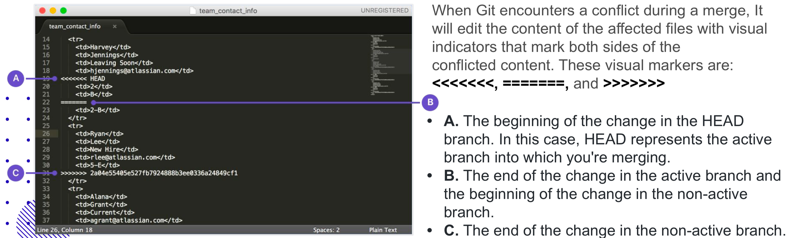

# Class-05 Git
## 主要知识点
[1. Git的安装](#1-git的安装)  
[2. 为什么要使用Git](#2为什么要使用git)  
[3. 两种版本管控的方式](#3两种版本管控的方式)  
[4. 如何设置Git](#4如何设置git)  
[5. Git的本地工作方式](#5git的本地工作方式一条线的历史)  
[6. 如何创建与合并branch](#6使用git-branch进行创建与合并分支两条线的历史)  
[7. 怎样使用remote repository](#7使用github进行团队写协作多条线的历史)  
[8. merge和rebase的比较](#8使用merge和rebase进行日常协作)

## 课堂笔记

### 1. Git的安装
https://git-scm.com/downloads

确认是否安装成功：Terminal/命令行提示符里敲 `git`,通过返回结果判断。
Windows用户可以去ms应用商店下载Windows Terminal,命令行操作体验要优于CMD

### 2.为什么要使用Git
我们日常对文件版本的控制，会包含，或者希望完成：
+ 撤销改动`revert`，彻底回归到之前到版本（回滚操作）
+ 对不同版本进行比较（回溯历史）
+ 不同工作内容部分的整合 （协同合作）
+ 保存历史版本（备份）

### 3.两种版本管控的方式
#### a.集中式（subversion为代表）
工作文件全部存在central repository, 工作人员把需要工作的文件从central repository中下载了下来，更新修改并完成提交（`commit`）; 这位工作人员在本地的文件只有download下来修改的文件
 + 起源：传统软件开发公司中，因为不是开源，source code都在公司的 central repository, 你的工作需要哪部分，才能下载那部分代码，本地修改完成
 + 同样提供了各种版本控制功能：
    - Log:提供历史记录
    - Merge:文件合并
    - Revert:版本回滚
    - Branch:版本分支
#### b.分布式（git为代表）
Open Source 开发中，没人愿意去设置一个central repository, 于是就有了一个remote repository; 在本地有一个local repository, 也不再是working copy, 而是一个完整的repository。 通过`pull`/`fetch`会拿到remote repository的完整文件, 包含完整的log；通过`push`提交修改过的文件  
分布式version control：没有一个集中式的server，在本地就有一个完整的repository  
现在大公司也开始逐渐迁移项目到git上
#### c.GitHub
提供了一个第三方的免费的开放式的托管平台，对于其他developer都是一个remote repository
 - 同时可以在上面进行：review, discussion, pull request, publish project  
 - Github免费平台并不意味着完全免费
    - 免费对象：small business(open source software), open source project, personal; 
    - 收费对象：private, enterprise，integration（功能）  
 - （repository）owner会对repository有管理权；每个参与者会有一个local repository, 同时跟remote repository有sync关系（download下来又推上去）

### 4.如何设置Git
 - 对Git版本进行确定  
 ```git --version ```
> 对软件版本没有必要盲目的更新，尤其是在工作中，要与团队版本一致  
 - 对Git配置信息进行读取  
  ```git config --global --list ```
    - core.editor: core是git的核心/关键设置，editor为编辑器（IDE）
    - core.excludesfile: 记录哪些类型的文件是by default被ignore的
    - merge.conflictsytle: merge的style,一般取 `diff3`
 - 使用命令直接配置Git  
    ```git config --global user.name "xxx"```   
    ```git config --global user.email "xxx@xxx.com"```  
    ```git config --global color.ui auto```  
    ```git config --global merge.conflictstyle diff3```  
    ```git config --global core.editor "code --wait"```  
    - 如果`code`没有设置，需要先添加VS code，具体参考 
        Mac版本 :https://code.visualstudio.com/docs/setup/mac  
        Windows(需要添加enviroment variable):https://www.architectryan.com/2018/03/17/add-to-the-path-on-windows-10/
    - 配置完成`code`后，可以直接通过命令  
    ```code .```  
    来在IDE中打开当前目录
 - 通过新建/修改config file，完成配置  
        ```git config --global --edit```
 - 完成配置后，需要set up 一个local repository  
     - 使用命令  
     ```git init```  
     将当前文件夹变成一个git repository, 让Git去monitor/tracking/changes 
     - 使用命令(只有拉取remote repository时才有用)  
       ```git clone```  
 - 添加新文件到当前目录中，可以使用 直接添加内容到文本的到命令  
 ```echo "hello world" > text1.txt```  
 - VS Code中，左侧大写字母，表示的文件状态为  
    - U - Untracked  
    - A - Add (seems to be)  
    - M - Modified   


### 5.Git的本地工作方式：一条线的历史  
- Git工作原理：两步commit  
    - 首先需要将文件stage（将文件加入到Git的tracking环境中）,一个没有被stage的文件，对Git是untracked的  
    ```git add <file>```  
    或者  
    ```git add .```  
    将当前目录下的文件全部stage。一个stage过的文件，只是说Git会monitor它的修改，不代表它会被Git完全tracking
    - 然后通过命令  
    ```git commit```  
    才能将文件从working directory上传到repository  
    `commit`命令后，系统会跳出窗口要求添加信息，如果想跳过editor编辑，可以直接使用命令  
    ```git commit -m "add a new file"```
    - 撤销之前的commit或者comment：  
     ```git commit --amend ```  
- 查看Git状态的命令：  
```git status```  
- 将文件从stage中移除的命令：   
```git rm --cached <file>```  
例如，```git rm --cached .\file1.txt```  
- 将文件暂存的命令(一般该文件尚未被stage/git add，仅仅是完成了本地编辑并保存)：  
```git stash```  
例如，```git stash -m "temp file"```
- 查看stash里存在文件的命令：  
```git stash list```  
- 将stash里的文件，取出的命令：  
```git stash pop```  
或者
```git stash apply [--index]```  
>  `commit`的`message`一定要有意义，否则几个月后，想回溯版本很难通过log找到想回溯的版本信息  
- 将文件从tracking中移除的命令：   
```git rm <file>```  
同时也会令文件被删除，但是命令过后需要`commit`进行确认
- 对比当前目录下，文件修改前后的命令：  
```git diff <file>```  
- 将文件还原到没有修改的状态：  
```git checkout <file>```  
或者还原整个目录  
```git checkout .```
- 将没有被tracking（没有commit到repository）的文件全部删除的命令，有一定危险性：   
```git clean```  
   - 默认情况下需要加`-f`强制执行   
   ```git clean -f```  
- 通过图形化插件，直观了解Git history  
   - VS Code extension里搜索`git history`，后通过 `shift + command + p`(mac下) 命令调出窗口，搜索`git history` 打开插件使用  
- 回滚历史版本命令：  
```git revert <id>```  
   - 需要先用命令，来查看当前目录所有的history:  
   ```git log```  
   调取`commit id`, 再加入`revert`使用
   - 所有`revert`都会产生新的`commit`才能完成，因此会留下`commit`记录  
- 完全删掉tracking的操作：  
```git reset <id>```
   - 会删掉`commit id`之后的所有操作，并把删掉的放入`unstaged`里  
> `git reset` 会直接delete掉`commit`，看不到操作记录，所以很危险，不推荐，工作中一般也不会用  
- `Terminal`类软件的安装(mac)  
  - https://iterm2.com  
  - Fish or Zsh (see https://medium.com/macoclock/awesome-command-line-tools-for-the-mac-42d810dacf93)
  - `Windows`下使用`Windows Terminal`

### 6.使用Git branch进行创建与合并分支：两条线的历史
从一个起点开始，创建branch，把彼此的工作分隔开,避免工作间会有冲突；后面也可以把多条线合并(`merge`)  
- 创建一个新branch的命令：  
```git checkout -b <branch name>```  
例如：```git checkout -b feat1```
- 切换到某个branch的命令：  
```git checkout <branch name>```  
例如：    
```git checkout master```  
```git checkout feat1```
- 列出所有branch的命令：  
```git branch```  
- 删除branch的命令：  
```git branch -d <branch name>```  
   - 删除当前branch前，需先switch到master下  
  ```git swith master```  
   - 遇到权限问题，如果要强制删除，需要加`-D`，例如  
   ```git branch -D feat3``` 
   - 重命名branch，可用：  
    ```git branch -m <旧名字> <新的名字> 重命名分支```   
- branch的命名：名字要具有意义，格式一般为  
```<type>/<ticket number> - <title>```  
例如  `feat/JR-101-create-header-for-home-page`  
- 将开发完成的功能加回master,需要的合并命令：  
```git merge <branch name>```  
例如：```git merge feat1```
   - `merge`前，自身必须在on receiving branch
   - `merge`操作后，被合并的branch并没有被删掉
   - 如果`merge`时，master branch的东西比当前的branch新，需要先在当前branch里执行`git merge master`来更新当前branch下的文件
- `merge conflict`：如果冲突的两个文件，不同处, 在不同的行，系统则可以auto merge  
   - 如果系统无法auto merge，则会弹出编辑器，进入手动修改模式。修改完成仍然需要使用命令  
   `git add file`
   与
   `git commit`来完成merge操作
   - 建议在vs code里弹出的conflict 解决窗口中，选择`accept both changes`，即将两边的内容同时接受，再酌情更改
   - 关于在conflict的显示内容，其中的符号含义，可参考下图
     

### 7.使用Github进行团队写协作：多条线的历史
现在工作中多用Github，有的公司里可能用到自建的Git Server
- 将remote repository的内容download到本地：  
```git clone <url>```
- 首先在Github里新建一个repository  
   - 下面选项中```Add .gitignore```可以选上项目的类型，这样在后面的`git add`命令时，将exclude掉不属于该类型项目的文件  
- 从remote中更新本地文件，将服务器上的新文件拉取到本地：  
```git pull```
- 拉取远程分支更新到本地仓库。   
```git push```   
   - 在将本地一个新的branch`push`到remote repository前，需要先确认是否已经使用命令，配置好了remote repository：
   ```git remote add <name> <url>```
   - 然后对于本地新建的branch，更新到remote时，需要加入完整的参数，告之云端原本的branch为origin，例如  
   ```git push --set-upstream origin feat1```
- 在不使用命令的情况下，VS Code中完全可以使用图形化界面完成以上各种操作（stage, commit, push, pull...）  
   - 具体可看课程视频(13期web full stack: Lesson 05Git Introduction 2:55:48~2:58:22)
   - 其中`sync`标签的意义为"pull + push",即先进行`pull`操作再进行`push`操作  
   - `fetch`标签的意义为get lastest information，但并不会真正的拉取文件
- Github中，拉取请求`pull request`  
   - 一般情况下，master branch是一定不可能被直接`commit`上去的
   - 每个developer会有自己的一个working branch，但是并没有管理master branch的权限
   - `pull request`之前必须解决所有的conflicts,解决冲突，谁后提交谁解决冲突，一般在自己的代码上解决冲突，未经允许不要改别人的
   - 如果遇到没有权限的repo，可以使用Fork加到自己的repo，做完修改之后可以apply a pull request against the original one
   - 在经过审核后，developer可以将已经完成的branch通过发送pull request， 来将自己的branch合并到master branch里
   - master branch owner端会看到pull request,并自动监测conflict情况，在进行review后，来最后批准merge
   - 在完成merge操作后，一般会把working branch删除掉
- Github中，通过`.gitignore`文件去exclude一些文件，可以自己写，也可以找模版  

### 8.使用merge和rebase进行日常协作
> 在merge过程后，因为一般都会把working branch删除，所以会丢失working branch中的记录，因此，很多公司避免使用`merge`，而转用`rebase`
> 但是Sean老师建议，rebase locally使用就好，如果public使用，同样会出现问题：The golden rule of git rebase is to never use it on public branches.
- rebase会在merge后，将working branch的记录一起带过来，所以开发的历史记录会一直保留，同时使master branch一直保持单线结构
- 如果使用`merge`来合并操作，在不删除working branch的情况下，一般都会有很复杂的commit历史结构
- ` squash merge` squash and merge，将很多对于同一个feature的commit整合后再进行merge，使这些commit更好理解。但可能引起一些问题，例如不方便revert
- 与`merge`相同，用`rebase`前需要先`check out`到on receiving branch
- 如果`rebase`过程中出现conflict  
   - 需要先解决conflict,然后使用  
     ```git add/rm <conflicted_files>```
   - 然后继续使用命令，完成`rebase`   
     ```git rebase --continue```   
- `rebase`同时还具有修改和调整commit历史记录的功能
  - 具体命令为`git rebase -i <commit hash>`, 其中commit hash为git log中 commit的hash
- 通过网站进行git练习：http://git-school.github.io/visualizing-git/
> 一般没有人会去做force push, `git push -f`，因为会强行覆盖，很危险
- Cherry Pick:从git的history中，拉取某一个commit,把它apply到哪里
- VS code中可以直接clone remote
> 首先搞懂clone，git branch，commit push， rebase ，pull request merge，这几个就够了  
- 对命令行比较吃力和没理解git流程的同学建议看这两个视频（总共20分钟)  
[git教程入门](https://www.bilibili.com/video/BV1KD4y1S7FL)   [git教程进阶]( https://www.bilibili.com/video/BV1hA411v7qX?spm_id_from=333.788.b_636f6d6d656e74.4)  
- How to set personal token  
  https://docs.github.com/en/free-pro-team@latest/github/authenticating-to-github/creating-a-personal-access-token  
- Set up SSH key   
  https://docs.github.com/en/free-pro-team@latest/github/authenticating-to-github/generating-a-new-ssh-key-and-adding-it-to-the-ssh-agent
- 例子一：开发分支（dev）上的代码达到上线的标准后，要合并到 master 分支
```
git checkout dev // 切换到dev分支
git pull // 拉取dev分支下最新的内容，同事可能修改了，有冲突的话要解决
git checkout master // 切换回master分支
git merge dev // 在master分支上合并dev分支，有冲突的话要解决，用rebase也行
git push // 推送新的master
(注意：如果有多个主机push要用 git push -u origin master，-u orign指定origin为默认主机)
```
### 9.其他
- 基本Terminal命令：
   - 创建文件：  
     ```touch term-paper.txt```
- 在`clone`一个branch后，往往要先进入这个branch，再进行操作
### 作业
- 完成git练习后把github的url发给tutor(Git要学会操作，P3会日常使用到)
~