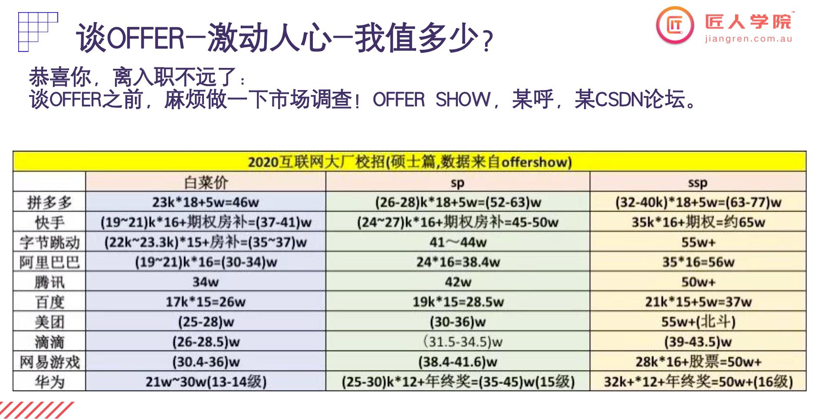
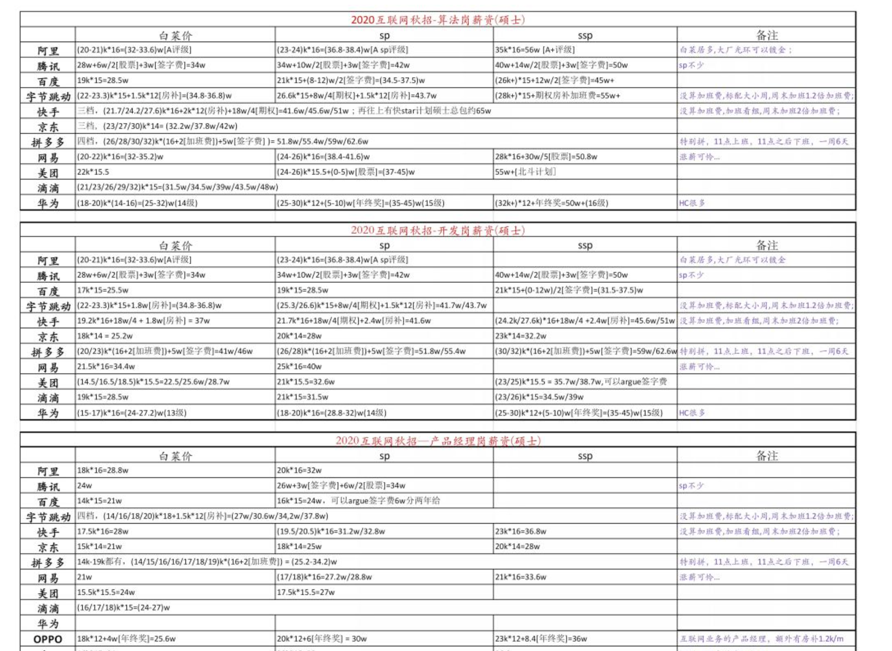
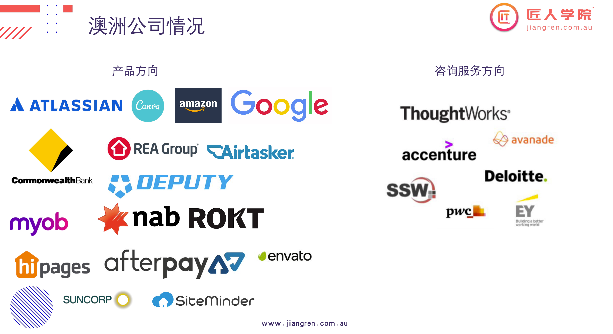
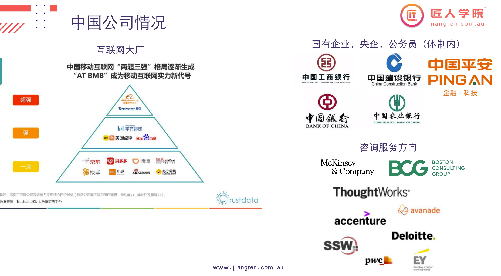
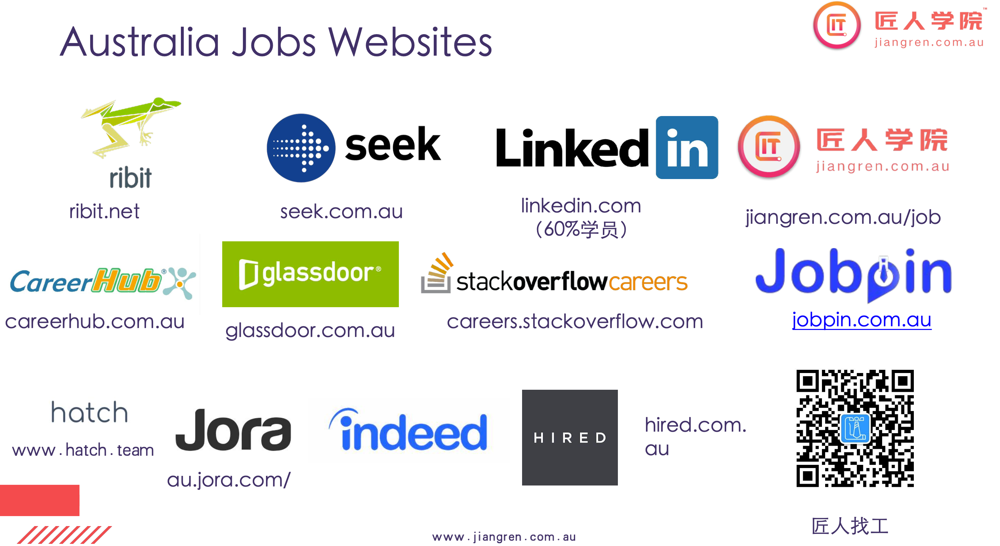
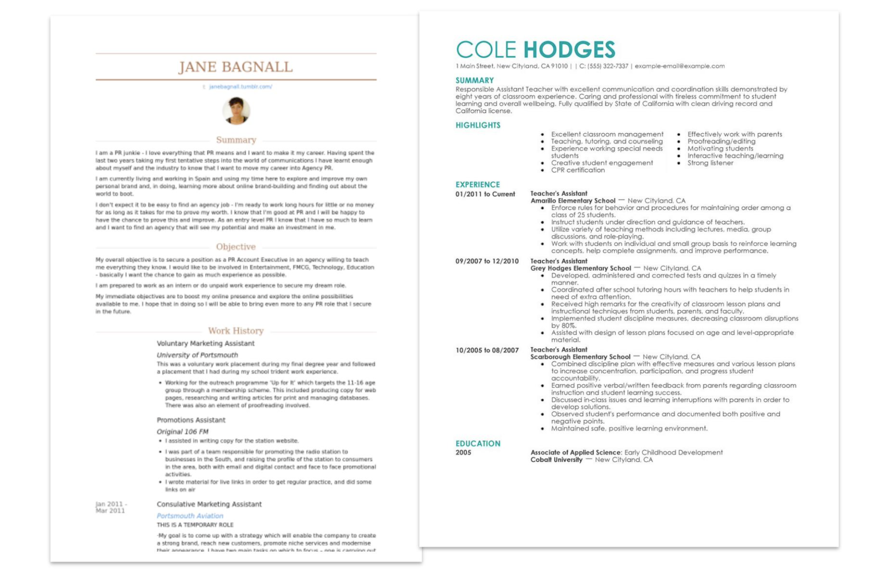
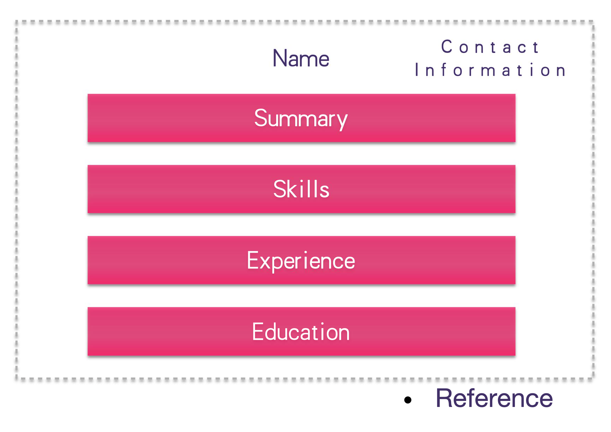
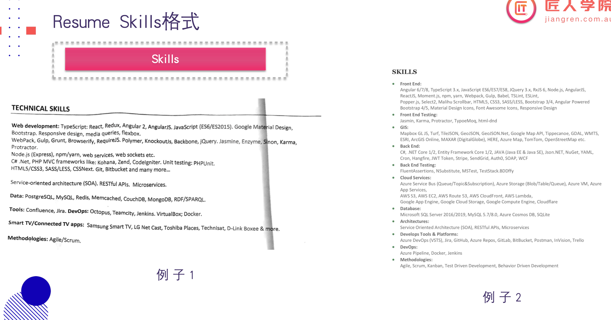
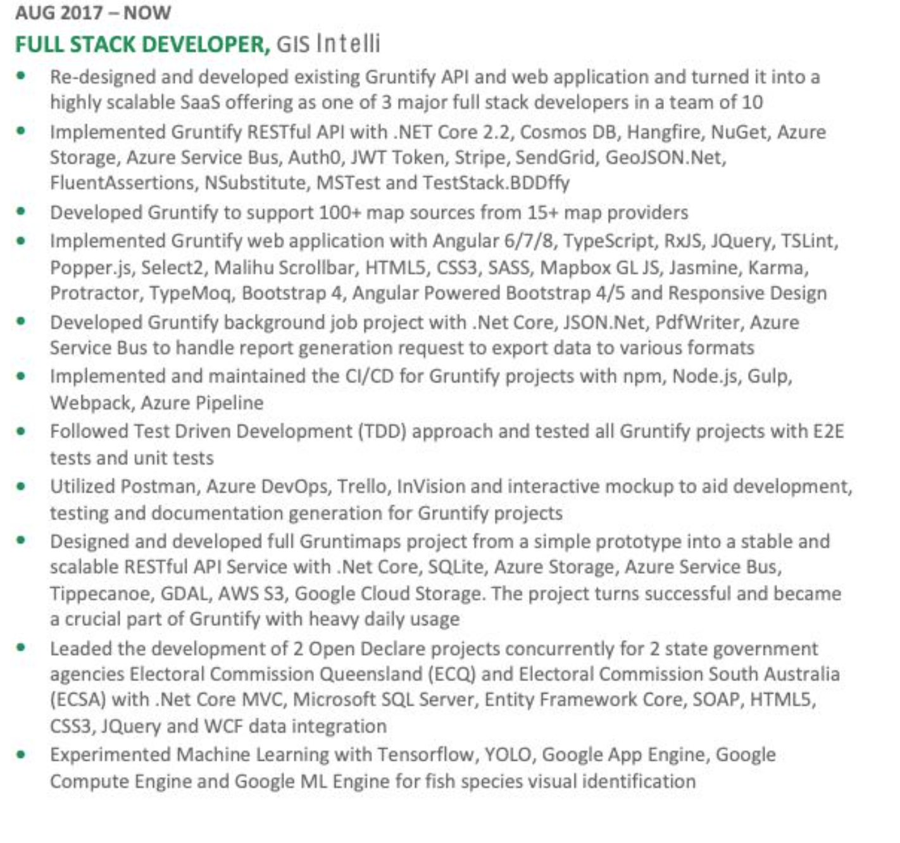

# Class-08 Career
## 主要知识点
  - [1.澳洲整体就业情况及相关知识](#1澳洲整体就业情况及相关知识)
    - [1.1 澳洲毕业生IT行业就业情况](#11-澳洲毕业生it行业就业情况)
    - [1.2 澳洲毕业生找工作的两个方向](#12-澳洲毕业生找工作的两个方向)
    - [1.3 澳洲毕业生回国就业情况](#13-澳洲毕业生回国就业情况)
    - [1.4 澳洲毕业生找offer的建议](#14-澳洲毕业生找offer的建议)
    - [1.5 澳洲IT公司情况](#15-澳洲it公司情况)
    - [1.6 中国IT公司情况](#16-中国it公司情况)
    - [1.7 澳洲找工网站](#17-澳洲找工网站)
    - [1.8 中国找工网站](#18-中国找工网站)
    - [1.9 工作内推的真实情况](#19-工作内推的真实情况)
    - [1.10 澳洲公司内的工作类型](#110-澳洲公司内的工作类型)
    - [1.11 获取工作的方式](#111-获取工作的方式)
    - [1.12 匠人学员找工作的优先级](#112-匠人学员找工作的优先级)
    - [1.13 学会看招聘信息](#113-学会看招聘信息)
    - [1.14 学会看员工评价和工资参考](#114-学会看员工评价和工资参考)
    - [1.15 课间Q&A](#115-课间qa)
  - [2.Linkedin的使用方法与技巧(重点)](#2linkedin的使用方法与技巧重点)
    - [2.1 Linkedin connection机制](#21-linkedin-connection机制)
    - [2.2 Linkedin 如何扩展network](#22-linkedin-如何扩展network)
  - [3.澳洲公司的招聘流程](#3澳洲公司的招聘流程)
  - [4.CV(重点)](#4cv重点)
    - [4.1 对于简历的重要声明](#41-对于简历的重要声明)
    - [4.2 关于简历的事实以及反思](#42-关于简历的事实以及反思)
    - [4.3 简历的原则](#43-简历的原则)
    - [4.4 好的简历长什么样](#44-好的简历长什么样)
    - [4.5 问答部分](#45-问答部分)
  - [5.匠人CV的格式(重点)](#5匠人cv的格式重点)
    - [5.1 Resume Header](#51-resume-header)
    - [5.2 Summary](#52-summary)
    - [5.3 Skills(重要)](#53-skills重要)
    - [5.3 Experience(重要)](#53-experience重要)
    - [5.4 Education](#54-education)
    - [5.5 Reference](#55-reference)
    - [5.6 其它需要注意的地方](#56-其它需要注意的地方)
  - [6.Cover Letter](#6cover-letter)
  - [7.作业](#7作业)

# 课堂笔记

## 1.澳洲整体就业情况及相关知识
### 1.1 澳洲毕业生IT行业就业情况
- 澳洲雇主非常看重(本地)工作经验
  - 国内一线大厂转澳洲，也会遇到困难：并不是因为经验问题，而是因为技术，英语能力
  - 实习经验还是很重要的
    - 但是如果太长时间的实习，比如一年，反而会让employer产生很大的疑问，比如为什么这么久没有正式的工作
    - 对于实习，最多两段就够了
  
### 1.2 澳洲毕业生找工作的两个方向
  - 找工作的两个方向
    - 校招：Graduate Program 
      - 一般都要求是 PR/citizen，但是对于IT学生，该要求可能不用
      - 国内也分春招和秋招
      - 申请人特别多，录取率很低，其实就是类似于管培生的培养
      - 薪水属于入门级，很多（IT）公司招，目的是培养devops engineer
    - 社招：大部分学员的选择
      - 分为三种level
      - Entry Level
        - 要求工作经验非常少，可能只要几个月
        - 竞争非常激烈（一个岗位可能收到上千份简历），薪水又很低
      - Junior Level
        - 不是面向毕业生招的，而是属于公司的初级岗位，一般需要2～3年工作经验
        - 要求经验这么高，怎么入门？不用害怕，其实只是在公司的一个岗位（属于初级，入门的）而已
      - Mid Level
        - 一般Job Title都不会写，不会写`mid developer`这样
        - 很多匠人的学员申请的都这个
        - 匠人学员的简历比较专业，如果申请entry或者junior可能会让雇主认为over-qualified
        - 匠人学员做完P3能力可以达到这个级别，虽然不能完全具备这些经验，但是便宜
        > 认可自己的优势，就是能力达到（有经验），而且便宜（接受7，8W的工资）

### 1.3 澳洲毕业生回国就业情况
  - 澳洲IT毕业生回国就业情况
    - 如果投独角兽公司，最大的问题是要面对：清北，常春藤，英国G5
    - 春招：实习偏多
    - 秋招：full time为主
    - 申请一线头部公司面临的最大问题：算法偏弱
      - 校招刷算法题
      - 想清楚自己在什么位置
      - 
      - 

### 1.4 澳洲毕业生找offer的建议 
  - 找offer的建议
    - 硬实力：技术部分（全栈班培训的部分）
      - 可能占到雇主考量的80%
    - 软实力：`沟通能力`,英语水平,性格,文化融入程度, Team Match
      - 沟通能力（目前最头痛的地方），不能实现来回沟通
        - 比方说，要求做A功能，雇员没有回应，做出来B功能
        - 希望你们在project中锻炼
        - 能直接决定要不要你的部分
    - Team Match:
      - 招入的新雇员，能不能融入团队，令团队稳定，他使用的技术，能不能被团队直接使用，代码沟通能力如何
      - 华人在这部分，尤其是面试中，表现的，特别容易紧张，不会讲笑话；要有自信在，公司才会要你

### 1.5 澳洲IT公司情况

- 产品型公司
  - 类似于项目中的甲方，卖产品来赚钱
  - 技术要求更为深耕，愿意做产品的优化，打磨产品，研究技术
- 咨询服务型公司
  - 类似于项目中的乙方，以时间单位来赚钱
  - 在澳洲，好在乙方公司也不会很累
  - 希望知识线更广

### 1.6 中国IT公司情况

- 互联网公司
  - 要求跟澳洲IT公司比较接近，简历的要求也很像
  - 不喜欢招有咨询服务公司经验的程序员
  - 技术上喜欢更细，更深挖的东西
- 体制内公司
  - 简历有自己独特的模版
  - 建议去平安，技术比较新
- 咨询公司
  - 大部分的case是给政府做的

### 1.7 澳洲找工网站

- Linkedin：60%学员找到工作的地方
- Seek：必须去找的，在澳洲处于垄断地位的，大部分工作属于猎头发的，少量属于公司发的
  - 猎头是绝对不会收你们的钱的，而是收公司的commission（10%~20%）
- indeed：因为发岗位很便宜，所以有大量的工作
- stackoverflow:里面工作很多是IT的
- hatch：做实习，会有大公司机会；会跟你做video interview，等对方公司过来翻牌子
- 匠人：关注下匠人找工，强推
  - 适合学员的岗位，会首发在上面
  - 后面计划会开展 面经（面试机经）
  
### 1.8 中国找工网站
- 具体可以看课件
- 特别需要注意的是，在校生可以开始去牛客网刷题
- 算法面试
  - 10种经典算法题
  - leetcode熟练easy，偶尔medium

### 1.9 工作内推的真实情况
认清工作内推的本质：工作内推并不是帮你去拿到工作
- 企业内推目的:减轻招聘成本，提高招聘效率，获得适合的人才   
- 员工内推目的:赚取工作推荐费Reference Fee，为企业输血
   
澳洲普通公司岗位投递人数:
- Junior Level:几百份
- Mid Level:不到10份，需要介入猎头 
  - 在这个level，不论内推，还是直接投，基本都会被HR看到
  - 唯一区别是，内推的人，即使简历很烂，也会给个面试机会
    - 有面试机会，不代表你能真正拿到offer，最后还是看个人能力情况
    > 不要太迷恋内推，把希望寄托于自己，努力把自己能力提高上去

    > 简历这东西涉及到太多个人隐私，所以不要乱投，不要乱发

    > 第一份工作不要太多考虑工资的问题，一般就6～9万
- Senior:不到两份

### 1.10 澳洲公司内的工作类型
- Permanent role
  - 属于employee
  - 在合同里没有end date
  - 跟公司是b2c关系
  - 拿到的工资是税后的
  - 有Probation试用期（3/6 months），试用期内正常发工资
  - 适合做房屋贷款(mortgage)
- Contractor
  - 不属于employee
  - 合同工，跟公司是b2b关系，可以被公司直接开掉
  - 可以拿到全部的钱，所以一般工资会比employee高20%左右，但是需要每年向ato补交税
  - 在公司里没有annual leave（4个星期年假+1个星期病假），除非是fixed-term contractor
  - 需要有ABN
  - 自己交Superannuation(9.5% , 14%)
  - 不好做房屋贷款(mortgage)
- Part-time & casual
  - 属于employee
  - 跟公司是b2c关系
- Notice Period
  - 离职或被解雇前，需要提前告知公司的时间
  - 工作小于一年，是一周
  - 工作在1～3年，是两周
  - 工作在3～5年，是三周
  - 高于5年，是四周
  - 面试时，要告知公司是2/4周后才可以工作

### 1.11 获取工作的方式
- Meetup：疫情前获取工作的最大机会
- Online
- Recruitor: 猎头
- Referral: 内推

### 1.12 匠人学员找工作的优先级
- Linkedin的JobPage(60%)  
- Indeed
- 自己喜欢的公司网站上查找
- 各大学的Careerhubpage 
  
### 1.13 学会看招聘信息
- 首先看是否是中介/猎头
  - 猎头是成交才有commission，所以会有各种办法先吸引你
  - 一般会说“our client”
  - 还有叫“inter-pro”，“people-bank”之类
  - 公司招聘，直面的是HR；猎头招聘，会先过猎头一关
- 职位名称
- 公司介绍
- 工作内容
- 基本需求
- 专业需求
  - ideal，nice to have的技能，意思就是必须的
  - 10条的匹配能满足7条，是比较可能拿到面试的
- 特殊需求
- 申请要求
- 通过阅读jd，可以基本分类出来工作环境，条件，日常的部分信息
- 越大的公司jd写的往往越简单，越简单的描述，考核起来越头疼；写的越具体，反而考核越简单，公司想要能力匹配的人，过来工作。

### 1.14 学会看员工评价和工资参考
- 去看https://www.glassdoor.com.au

### 1.15 课间Q&A
- Q：如果HR问，你的期望薪资怎么回答
  - A：一般给个准确的，7～8W之间吧；千万不要说看着给，显得这个人明显没有什么能力；建议大部分学员 6～8W之间；不建议报太高，真正进入公司3～4个月，再跳10W的工作是正常的。如果岗位明显是10W，就不要说7～8W了，最近几个匠人的学员都是拿10W以上的offer。在IT里面，干6个月跳槽是很正常的。
- Q：工资要求 plus super吗
  - A：看你怎么跟公司沟通，super一般是10%上下，对于第一份工作建议不要太在意，可以在签合同的时候问 能不能把inclule super改成+super。 
> 建议第一份工作不要太飘，主要靠半年之后的跳槽，如果能跳到10W以上的就完全OK了

## 2.Linkedin的使用方法与技巧(重点)
> 学员的杀手锏，我们主要围绕两个方向做优化：
> - `SEO`：搜索引擎优化
> - `Readability`：可读性，你的profile能否被别人快速get到你的特点及value
 
### 2.1 Linkedin connection机制
- 3层connection机制
  - 1st connection: 相当于你facebook，现实生活的好友，你可以不 受限制地给他们发送邮件，查看他们的profile
  - 2nd connection:就是你好友的好友...免费账户可以看到 profile，不可以发邮件
  - 3rd connection:好友的好友的好友...免费账户只能看到名字和 title，不可以发邮件
  - 除了以上三种，剩下的人如果你不做其他的networking，他们就是 parallel universe。
  - 从机制来看，最重要的一个优化点，就是增加你的1st connection，来扩大你的second connection，使你暴露出来

### 2.2 Linkedin 如何扩展network
- 如何增加自己的network
  - 通过添加Open Networkers（Lion）
    - 扩展2nd connection
    - 课上作业：加10个open networker
  - Recruiter
    - 加猎头前，分清有两类人，一类是HR，一类就是Recruiter
    - 加猎头前，要把个人的profile写好，还包括更新
      - 更新个人url
        - 进入个人profile后，右上角，点击`Edit public profile & URL`，再看右上角`Edit your custom URL`，修改，尽量不要出现任何的数字
      - 头像：不需要非常专业，但是需要自己真实的头像
      - Headline: 写出职业方向
        - 比如Full Stack Developer/Front-end Developer/React Developer
        - 摆出自己一个professional的姿态
        - 还可以 Full Stack Developer/ React/ Angular/ Agile Coach
        - 或者 python#R#shell scripting#Data mining...
      - About
        - 建议写上objective
        - 相当于CV的summary，突出你的工作经验/项目经验，专业背景
      - Experience
        - 包含工作经验和项目经验
        - 具体参考CV部分，也可以参考老学员的文本
      - Education
        - 可以加上JR Academy
      - Licenses
        - 跟专业相关的License可以加
        - 潜水证，驾驶证之类的不用加了
      - Volunteer experience
        - 基本上不会影响你任何找工作
      - Skills & endorsements
        - 能力背书
        - 写好自己的skills，可以找朋友过来点赞
      - Recommendations
        - 推荐背书，对找工作而言是很不错的
        - 如果P3做的不错，可以找老师
      - 最后可以关注一下`匠人学院`
    - 加猎头，搜`recruiter`；加HR, 搜`hr`
  - 全栈班学员目标：有500个connections
    - 建议每天吃饭，上厕所的时候加20个
  - 加到500 connection，技能ready了（项目做好了），就可以looking for role...
  - 总结Linkedin，就是先增加你们的connection，然后修改你们个人的profile，你的profile越吸引人，猎头挖你的几率越高
  - Linkedin如果猎头开启聊天，你没理他也没事，后面可以再联系，他也不一定会记得你
  - Q：如果linkedin有hr来问，但是自己现在还没准备到job ready状态的话怎么回他们比较好呢？还是就先不回了呢？
    - A：可以这么回，我现在正在做一个项目，你能不能两个月之后再来问我，我两个月之后就可以跳槽啦。

## 3.澳洲公司的招聘流程
  按照下面分项进行：
  - Resume/Cover Letter
    - 简历发送
  - Initial Interview(phone/Skype/face-to-face)
    - 一般是phone interview，问下个人情况
  - Online Assessment
    - 线上测试
  - Technical Interview
    - 技术面，看你的个人技术怎么样
    - 只要你走完了完完整整的项目，它一般就从项目问问题
  - Manager Interview
    - 谈薪水，看你的behavior，看Team match
  - Offer
  - Reference Check
    - 大公司一定会进行背调，
    - 一般找的就是你的上司，最差是你的同事
    - 背调一般问：你这个人在团队里做啥，这个人喜欢什么样的管理方式（例如agile），这个人优点是什么缺点是什么，有什么地方需要改进，他有什么良好的品质，是不是一个team player，是不是愿意帮助解决问题，你愿不愿意从新雇他，他离职的原因是什么
    - 最差的结果，如果被对方发现背调人是你的朋友，他们会重新考虑对这个candidate怎么办
  - Q: 背调 会确定对方的职位 在职时间 对吧, 如果有的老板不想给自己做背调怎么办😿
    - A: 这个挺常见，这个需要跟HR说，如果是猎头推的可以跟猎头说明，我们这个老板不愿意帮我去做背调，理由一定要很好（他比较忙，也不喜欢给你做背调），你可以提出背调同事，senior manager可不可以。背调主要是去check 面试的真伪性，过去经验的真实性，同时为这个人做背书。有的时候离职的原因，可能也是因为前老板剥削你，但是不要表达不清楚，让对方觉得是你瞎想的。
  

 ## 4.CV(重点)
 ### 4.1 对于简历的重要声明
 - 重要的声明
   - Professional 的简历以匠人为准（重要）
   - 不听任何来自PY老师的简历
   - 专业简历就是专业简历
     - 改简历的必须是这个行业的，在澳洲工作的
     - 可以去问别人对自己简历的意见，但是一定要qualify对方的身份，最起码是大公司背景
  
 ### 4.2 关于简历的事实以及反思
 - 关于简历的一些事实
   - HR看你简历的时间第一次只给6s：看个开头，看个结尾，看中间的描述像不像一个professional
   - 如果被吸引到，会花5-10mins再仔细看
 - 对简历的一些反思
   - 第一面一定要吸引人
   - 但是也要认清自己的现实：相关经验少，skills少，简历内容不够充实不能去吸引你
   - 对方有job description（jd），你的简历跟jd有多匹配，匹配程度越高，拿到的概率越大
   - 你的核心竞争力是什么，你有没有核心竞争力
     - 如果你做过了commercial project，而且已经上线了，这也属于核心竞争力
     - 跟你的专业性相关的技能，也可以作为你的核心竞争力，比如你是UI Designer + Full Stack developer，或者Full Stack developer + Devops engineer，外加很多的项目经验
 - 关于简历上陈述的Fact
   - Education：亚洲人HR可能喜欢去看，local并不太关心
   - Skills，Current Title：这部分是最重要的
    
### 4.3 简历的原则
 - 简历的原则
   - 不要花哨，要简单明了，够professional，千万不要用黄色/绿色
   > 专业简历更注重你的skills，technology和你的经验，这是你们的重中之重

   - 不要两栏，排版很难控制；one colomn足够
     - skill的柱形图，是极其没用的
   - 简历中不能出现减分项，比如 不是PR
    
### 4.4 好的简历长什么样
   - 正确的简历：

    - 要非常整洁，写出自己是什么样的人
    - 头像如果非要加，要圆形框出来，一般建议不加头像，避免出现性别，种族歧视  
    - experience部分，时间为优先级，最近的工作写在最上面
 - 最好的简历什么样子
   - 首先你不要放任何profile photo
   - 放上你的portfolio链接和项目链接
   - 你的Core Skills
   - 千万不要 one-page resume
   - 工作经验或者项目经验中，尽量出现：
     - URL
     - Responsibility
     - Duty
     - Performance 
 - 简历的核心原则：
   - 不写 = 不会
   - 比方说python，你不写，就是你不会；你写了，说明你可能会，但是不会有所期待
    
### 4.5 问答部分
 - Q&A：
   > Q：以后投简历的话有什么推荐路线吗？比如先投小公司再投大公司？
    > - A：一般建议，投5个公司，投完5个以后，等反馈，看一看有没有没有面试的机会。如果没有面试，说明简历有问题，需要重新再修改。一般修改两三次就可以了。只要你的简历符合要求，一般会被安排interview的。
    - Q：简历上有gap影响大吗
      - A：没关系的，没人会care你的gap，最多问一下


## 5.匠人CV的格式(重点)
 
### 5.1 Resume Header
 - Resume Header:
   - Name：Brand Name(尽量写 英文名+姓),下行跟job title
   - Contact Inforamtion
     - mobile: 一定要是准确的
     - address：要写到surburb，不要写到门牌号
     - email：你的professional name convention，邮箱不要用qq，新浪，163
     - Linkdedin URL：放完整的URL
     - Github URL
      
### 5.2 Summary
 - Summary：个人的介绍，对你个人的陈述 
   - 简明扼要，抓住个人亮点，如果个人工作经验比较多，可以强调工作经验多，如果工作经验比较少，可以强调项目经验多，突出数字，如果项目不够多，可以突出具体的project是什么 
   > Summary部分，需要写的：第一是工作过多少时间，第二是做过多少项目，第三是用什么技术，喜欢用什么技术，第四是突出个人的亮点
   - Lightman推崇bullet point格式，比如
   ```
   SUMMARY OF QUALIFICATIONS
   -------------------------------------------------
   - Extensive commercial experience in web development
   - Practical knowledge of web solution architecture, development technologies and tools
   - Strong software enginner with wide skills set
   - Efficient team player
   - ...
   ```

 ### 5.3 Skills(重要)
 - Skills（重点）：作为专业人士最重要的部分，列出你会的所有skills
  
   - 包含：技术，框架，前端，后端，测试工具...注意要分类
   - 技术的版本号要写：但是面试的时候可能问版本间的区别
   - Cloud Service：最常用的必写
   - 前端与后端的测试框架：一定要写
   - 不要写任何的熟练度
   - 技术分类要清楚，不要搞混，比如Git与GitHub，前者是技术，后者是工具
   - 你写过的skill，都要后面的experience做supporting
   - Q：我不会的技术要不要放上去
     - A：不会的可以写，但是一定要去学；你的简历可能两三周才会有反馈，你去学新的语言，很快会学会的；如果时间不够，可以说，“我最近的面试挺多的，能不能安排到下周”
   - Q：你写上的技术（例如typescript），他可能怎么问你
     - A：能不能给你使用的(typescript)的一个例子，有什么特点，可以讲一下(typescript)吗
   - Q：skills需要写软实力吗
     - A：无所谓，因为本身skills篇幅就很长了，不过大体可能不会看。
   - Q：jd里面没有要求的技能，但是自己会的要都写上吗
     - A：都要写上，jd里明确要求的，更要写上
   - Q：写上的技能是不是面试的时候都有可能问到，这样写得多了面试很难都回答好
     - A：公司只会关心他们需要的，不会关心你写的所有东西
      
### 5.3 Experience(重要) 
 - Experience（重要）：跟skills并列重要
   - 一定要最新的放上面
   - 一定要写的详细，会提高你经验的真实性
   - 如何描述你做的事
     - How would you write "I changed a light bubl" on your resume?
     - Single-handedly managed the successful upgrade and deployment of new enviromental illumination system with zero cost overruns and  zero safety incidents.
     - 把你的工作经验拆分，拆分成不同的几块进行描述
   - 
     - 建议上面第二行，公司的后面加工作的城市
   - Resume Experience的模版
    ```
    1. 项目描述:这个项目做的是什么，objective是什么
    2. 团队经验:这段经验团队多少人，自己在团队担任什么角色，突出Agile
    3. Team Work:团队经验里是否是team player，有没有帮助Team。
    4. 前端应用:框架用的什么，具体到版本号，哪些重点技术
    5. 前端测试框架:前端测试框架用的什么
    6. API应用:API应用使用什么规范，用的什么具体技术，怎样查看API，API文档如何管理的
    7. 后端应用:后端框架，语言，以及版本号，重点技术
    8. 后端测试框架:后端使用了什么测试框架，如何进行Unit Test
    9. 数据库管理:是否使用数据库版本控制，使用什么数据库，怎样部署 
    10. CI/CD使用:CI/CD应用哪些技术 
    11. App部署:涉及到前端和后端部署，具体应用，具体使用哪些工具 
    12. AWS使用:使用哪些AWS具体服务，帮助App实现了部署，通过什么形式帮助部署
    13.e2e测试使用:前端比如使用Cypress等 
    14.方法论使用:比如TDD使用 
    15.是否使用过DevOps工具，比如Monitor，logging等工具 
    16.Leadership:如果申请高级职位，体现leadership
    ```
    - 数据库管理里面可以加入flyway,现在developer知道的不多
    - 10，11，12侧重点不同，课上没有讲到的，要自己去看
    - 听别人讲简历，会听到一个STAR原则，即Situation（情景）、Task（任务）、Action（行动）和Result（结果）四个英文单词的首字母组合。 STAR原则是结构化面试当中非常重要的一个理论。但是不推荐你们用，会特别模版化。
    - 对比举例
      - WRONG: Did a Java project for a company’s POS system
        - RIGHT:
          - Using latest Java 8 technology with Spring framework to build a POS system
          - Successfully deployed to AWS cloud , EC2, Lambda
          - Successfully help the customer by increasing 10% of sales
      - WRONG: Fast Learner
        - RIGHT: 
          - IT dream since 10 years old
          - Passionate on technologies
          - Contributed on many open source projects 
          - Strong in theories • Love learning new things
      - WRONG: Led a 5-people team and successfully finished 3 projects
        - RIGHT:
          - Led a 5-people team with 2 frontend 3 backend
          - Successfully deliver 3 projects on time
          - Reduced resignation rate from 60% to 20%
          - Helped the developer to progress their careers and most of them are team leaders now
          - Love joining technical meetup
         
### 5.4 Education
 - Education：放到最后面
   - 不要写多了，GPA很高可以放，GPA很低不要放
   - 不要放学科代号
   - Achievements: 有奖学金放奖学金
    
### 5.5 Reference
 - Reference：可以加也可以不加，放到最后面

### 5.6 其它需要注意的地方 
 - 可以使用LMS的简历制作，来制作简历 
 - 管理你的CV版本
   - highlight different skill areas 
   - NAME-Year-VERSION.pdf
   - NAME-Position-Version.pdf
 - 字体管理
   - Fonts of 10 to 12 point size are the norm
   - Use a simple font such as Arial, Avenir, Helvetica - the most common fonts for business communication and scan the best
 - 简历可以互相proof reading一下

## 6.Cover Letter
现在用email去投，email的body就是cover letter。重点表明自己跟公司多么的match，然后吹一下，多么认可公司。最多可以帮你拿到面试。

什么时候需要用cover letter
- 在seek上投，单独写一封cover letter写给对方会比较好  
 
四个Section：
- Info paragraph
  - who you are, your expertise, the job you are applying for and how you found it, why you are a good fit for the job
  - 突出你的商业经验
- Body Paragraph：2 paragraphs max
  - 你个人经历跟这份工作多么的契合，自己对公司多么了解，觉得自己的skills多么match你们的需要，我能帮助公司提高多少
  - 可以举个例子，例如在第三行，个人可以怎样帮到公司提升
- Closing Paragraph
  - thank you for your consideration, call to action, availability for interview
- Signatrue
- Q: 如果公司没要求  是不是就不用写cover letter
  - A: 写一封email，body不可能为空，这时候就要写，要写清楚你有多么关心，多么渴望这个岗位；所以email求职，body要写的清楚

## 7.作业
- Your Story
- Your Working/ Project experiences (列出3个项目经验)
- Tell me about a time you had a conflict with another student and how you dealt with it
- Why did you change jobs frequently?
- Linkedin 500 connections