# ClassJ-09 Java后端基础
## 主要知识点
  - [1.课前课间讨论](#1课前课间讨论)
  - [2.网站应用系统在high level的讨论](#2网站应用系统在high-level的讨论)
    - [2.1 对系统的评价原则：](#21-对系统的评价原则)
    - [2.2 最简单的系统：](#22-最简单的系统)
    - [2.2.1 对系统的第一次升级，服务器分离：](#221-对系统的第一次升级服务器分离)
    - [2.2.2 对系统的第二次升级，增加cache：](#222-对系统的第二次升级增加cache)
    - [2.2.3 对系统的第三次升级，引入auto scaling和load-balancer：](#223-对系统的第三次升级引入auto-scaling和load-balancer)
    - [2.2.4 对系统的第四次升级，db服务器分离：](#224-对系统的第四次升级db服务器分离)
    - [2.2.5 对系统的第五次升级，引入CDN和分布式数据库：](#225-对系统的第五次升级引入cdn和分布式数据库)
    - [2.2.6 对系统的第六次升级，引入消息队列，NoSQL和搜索引擎服务器：](#226-对系统的第六次升级引入消息队列nosql和搜索引擎服务器)
  - [3.后端的High Level框架](#3后端的high-level框架)
  - [4.monolith vs microservices](#4monolith-vs-microservices)
  - [5.CAP原则](#5cap原则)
   
# 课堂笔记

## 1.课前课间讨论
- 从2004年起，Java行业的变化
  - 刚开始，使用的是JSP，那个时候没有前后端分离的概念，什么都做；后端后来逐渐变成,提供Restful API给前端；现在软件开发，越来越需要开发人员具备全栈；自从云计算出现后，对开发的门槛更加简单，同时对项目的开发和部署达到以前不敢想象的效率。现在行业里，越来越倾向于full stack，但是对某一样一定有精通。
  - CI/CD（非常重要）: Jenkins，AWS本身也提供了一些这方面的tools
  - 希望大家听过之后，回来再看，课上的内容是IT市场必须的
  > 在澳洲，现在对软件开发的要求，就是成为一个多面手。前端不要放，CI/CD/Devops都要学，AWS有空一定要去看，一定要去看，一定要去看
  - 不要跟国内的人纯拼技术，要拼综合（技术+沟通）
- node跟Java对比
  - 国内清一色Java
  - 澳洲小公司用Java不多，大厂Java多
  - NAB计划在五年内，把所有host在ECS上的application，全部migrate到Kubernetes
  - node一般做前后端的（backend-for-frontend），更容易入门一点
- 第一节课从High Level讲，告诉大家后端做什么
- 推荐两本书：
  - 大型网站技术架构（核心原理与案例分析）
    - http://bobzhang.dscloud.me/Calibre%20Library/Li%20Zhi%20Hui/Da%20Xing%20Wang%20Zhan%20Ji%20Zhu%20Jia%20Gou%20%28284%29/Da%20Xing%20Wang%20Zhan%20Ji%20Zhu%20Jia%20Go%20-%20Li%20Zhi%20Hui.pdf
  - 微服务设计（Building Microservices: Designing Fine-Grained Systems）
    - 看了两遍，感觉还不够
- Q:microservices 和 RESTful 是个什么关系 经常看到这两个词放在一起
  - A: Microservice：不仅仅是Restful, 还有如message-driven，更多的是一个理念；Restful：前后端交互提供的一个格式，不同的service调用也可以用。Restful API在后端是同步式的，发送一个请求后，要等待服务器响应；message-driven是异步式的
- Q:老师自学是主要通过书本还是视频
  - A: 澳洲本身要求你能快速的pickup一个东西（老板过来找你要快速搞定），自己先做一个小的investigation，给出学习需要时间，立刻找一个相关的视频，下班后回到家，继续研究，快速看视频，视频的作用是让你快速入门。视频仅仅能帮你到这儿，当你每天开始工作的时候，遇到问题就google，查文档，不断在工作中学习：“以战养战”。最基本的要求，通过Google把问题解决
- Q:aws考哪个方向比较推荐呢
  - A: aws associate， solution arch （开发建议考这个），developer（开发建议考这个），sys ops admin（不建议现阶段考）

## 2.网站应用系统在high level的讨论
### 2.1 对系统的评价原则：
我们期望系统有：
  - 高可用（high availability)
    - 在aws里面有，availability zone和region；比如悉尼，我们称之为sydney region，在这个region里我们有三个availability zone，这个三个zone物理位置不在一起，目的是防止一个zone出现物理意外时，其他zone仍然可以保证系统可用，这就叫high availability；比如阿里在双11，系统仍能流畅运行，就做到了高可用，高性能 
  - 高性能
    - 系统硬件性能比较好
  - 易扩展
    - 系统扩展性，小到我们写的class，method可以很容易的扩展；大到整个系统的搭建扩展
  - 可伸缩
    - 我们称为auto scaling，指系统可以scale out/scale in
      - 比如说我们系统搭建时，感觉性能不够，过去只能增加物理硬件（这个叫scale up,纵向扩展），这个缺点是成本高，而且有极限；现在我们选择横向扩展（scale out），我们会再起一个instance，或者server，来接收访问
  - 且安全
    - 比如说，注册登陆，请求发送到服务器端，服务器端会认证授权（Authentication/Authorization），授权后会生成一个JWT Token, 里面包含了用户的各类信息，后端会把这个Token发给前端，每次用户再有请求，前端会把这个JWT token放到request header里，发给后端。
      - JWT Token: https://jwt.io,
      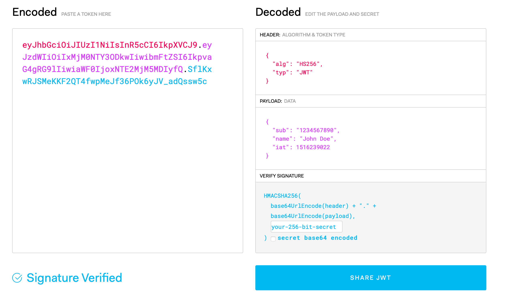 
      左边encoded部分即为token，主要用于跟前端交互，并使之安全
      - Authentication：输入用户名和密码，服务器端会验证是否是一个合法的用户
      - Authorization：服务器验证合法后，授予不同的权限
  - 好的互联⽹产品从来不是一开始就开发好的。而是不断演化而来的
   
### 2.2 最简单的系统： 
  - 简单系统
    - 每个物理机器/虚拟机（vm）上包含了图下所有的东西，即每个vm都可以作为一个应用server，aws里EC2即是一个vm。
     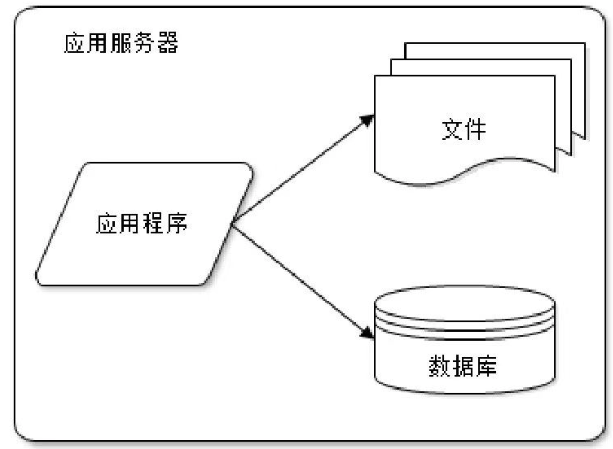 

### 2.2.1 对系统的第一次升级，服务器分离： 
  - 使用上图架构，当我们开发的网站，因为访问量过大，我们需要提升性能时，可以把应用服务器分开，例如物理上实现server的分离
     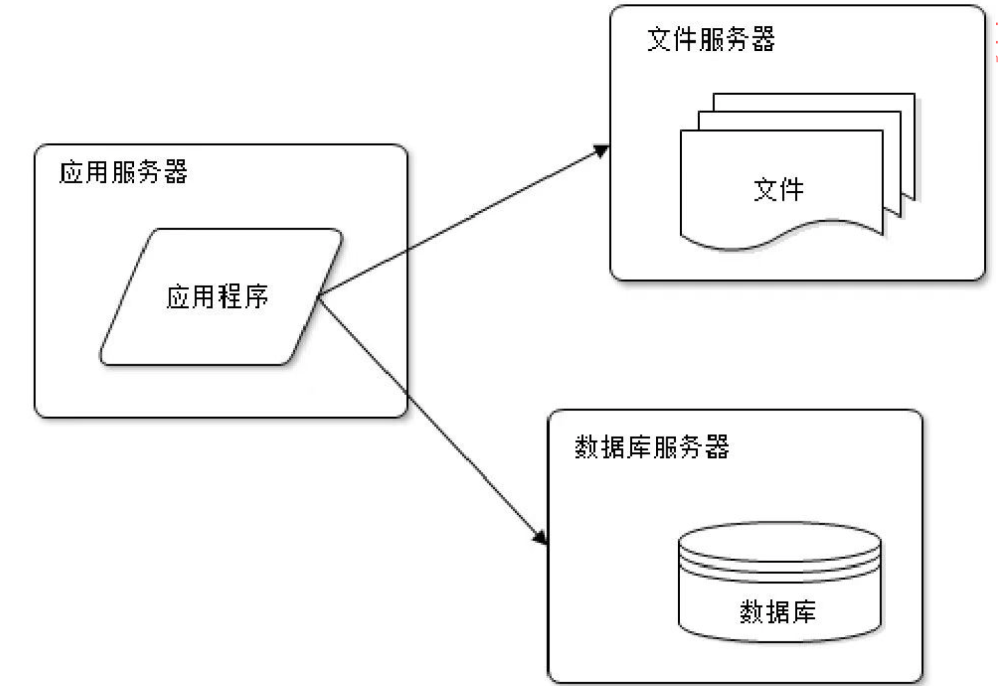  
     应用服务器对cpu要求高，数据库服务器要求cache高，文件服务器要求容量大

### 2.2.2 对系统的第二次升级，增加cache：     
 - 当访问量继续扩大，系统变慢，第一个该下手的地方是cache，cache被称为silver bullet，可以极大的提升系统的瓶颈，aws中的redis即为cache
     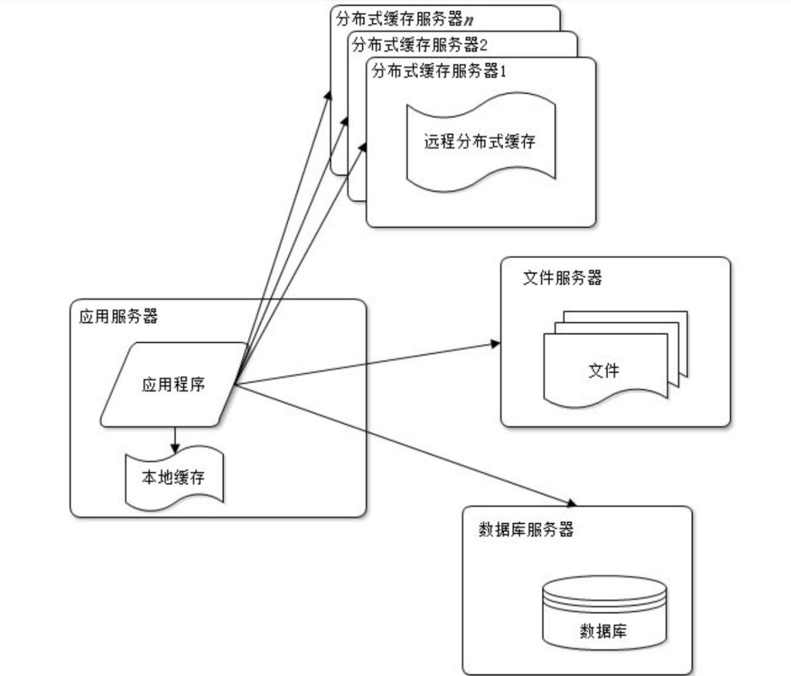
       每次我们访问应用程序，会要求db的读取，因此数据库很容易成为一个瓶颈，如果读取数据库前，数据已经储存在了cache里，那应用程序就会先读取cache，如果cache里没有，再去服务器找  
       使用分布式缓存，要优于本地缓存，因为本地缓存违背了一个基本的原则。我们希望我们的application要stateless（无状态），我们不希望我们的应用程序保存任何状态

### 2.2.3 对系统的第三次升级，引入auto scaling和load-balancer：
- 进一步升级，引入auto scaling和load-balancer；增加应用服务器数量，中间多组应用服务器即为auto scaling（当访问量越来越大时，会自动将应用服务器扩展，理论上可以无限扩展）；对于请求如何合理分配给应用服务器，就需要到load-balancer(负载均衡调度服务器)
     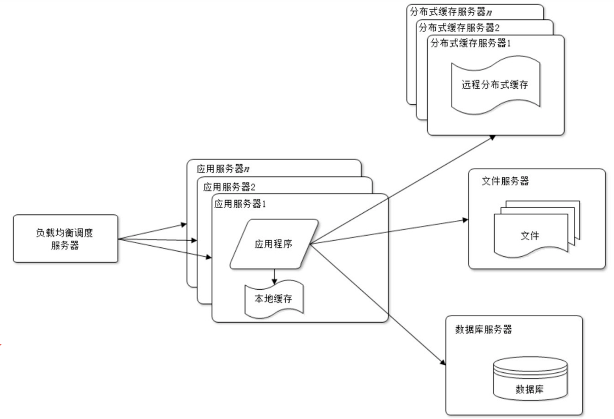
      - AWS里提供了三种不同的load-balancer：ALB，NLB，Classic LB(几乎被淘汰了)
      
### 2.2.4 对系统的第四次升级，db服务器分离：
- 再继续升级，引入db的master-slave, 我们需要将服务器主从分离，aws中对应RDS
     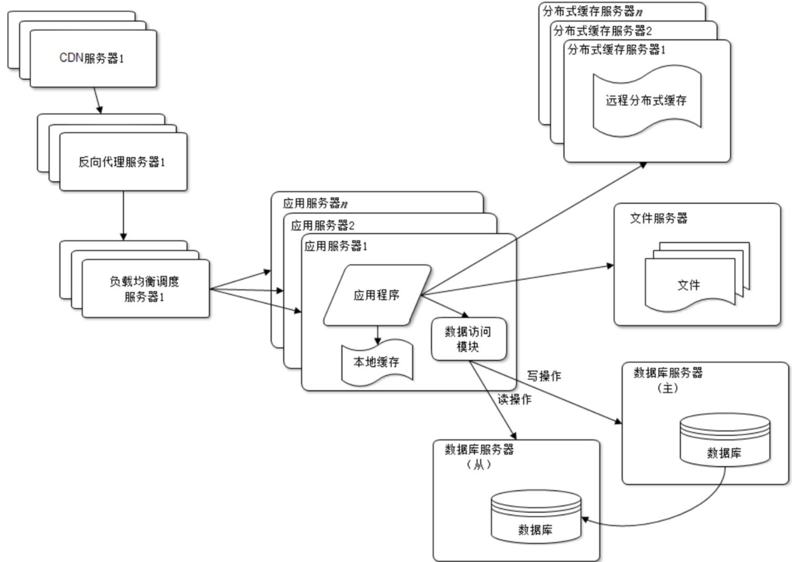
      - 主数据库负责写入  
      - 从数据库负责读取  
      - 他们之间实现replication  

### 2.2.5 对系统的第五次升级，引入CDN和分布式数据库：    
- 再升级，我们要引入CDN（aws cloudfront，在NAB中用的是akamai），和分布式数据库（在澳洲已经很少见了，因为并不需要这么高的性能）
     
      - CDN跟cache非常像，对用户的请求反馈，可以cache在CDN里，这样用户的类似请求，就不需要来remote 访问了，可以大量提升性能
 
### 2.2.6 对系统的第六次升级，引入消息队列，NoSQL和搜索引擎服务器： 
- 最后，我们还可以引入消息队列（message driven system），aws中对应SQS；以及NoSQL，搜索引擎服务器
     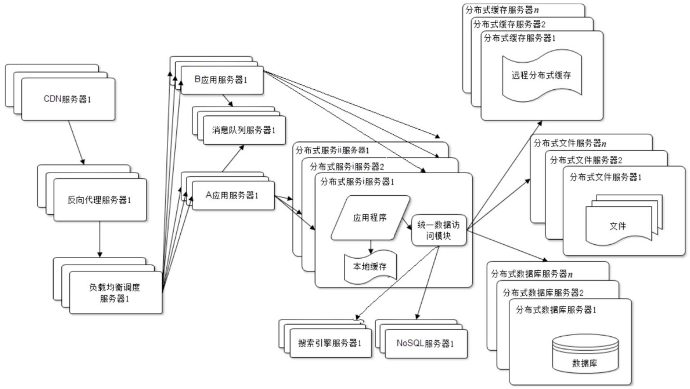
      - 当我们的服务器提供两个应用，应用之间想实现异步通信，就要用到message driven   
    - Q：A服务器  B服务器  中间要用消息队列通信  这是什么应用场景
        - A：应用场景很多，比如发Email，填入信息注册，点击注册按钮后，你会收到一个email，该场景中，如果发email和用户注册写在一起，会耦合度太紧，这时候我们可以开发注册的应用和发email的应用，这两个应用可以用完全不同的架构，如何实现两个功能的通信：可以建立一个消息队列来链接异构系统 
        - message driven system 降低了耦合，在后端应用非常非常多；而且可以令后端应用无限扩展
        > 如果一个功能在线上已经很稳定了，我们尽量不要去touch它
        - 后端开发，一个是RESTful API，一个是Message Driven
          - RESTful API：同步式
          - Message Driven：大部分是异步式的
    - NoSQL：not just SQL，例如mongoDB，aws的dynamoDB
    - 搜索引擎服务器：ELK vs Splunk

## 3.后端的High Level框架 
Java后端，high level上，用springboot开发microservice的架构
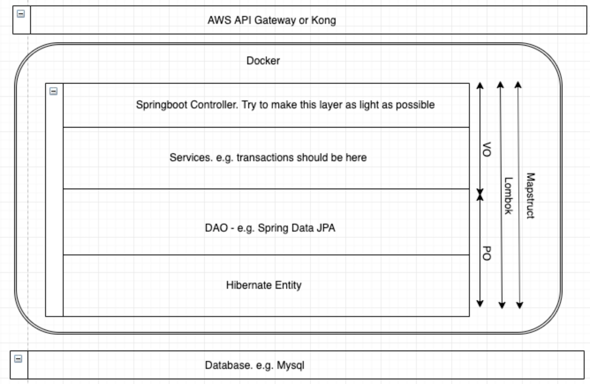
- Datebase: 我们课上用PostSql，因为市面上基本都用PostSql
- Hibernate Entity：用来连数据库的，是一个OR mapping工具
- DAO：Data Access Object，我们用Spring Data JPA，可以很方便的对数据库进行CRUD（增删查改）操作
- Service：面向业务逻辑，business requirement都是在这里实现，transaction也是在这里完成
- Springboot Controller：原则上我们希望这层代码越少越好
- Q：不太懂 Hibernate 和 JPA 两者具体是什么  是框架 还是规范  两者关系是什么？
  - A：JPA是一个规范，Hibernate是基于这个规范下的一个implementation。Jdbc是一个非常底层的东西。
- Lombook：小工具，可以让我们simplify我们的代码
- MapStruct：DTO与Entity间的mapping
  - DTO vs Entity
    - Entity是OR mapping
    - DTO是给外接用的，前端用的，specific for frontend
- 上面一些会放到docker image里
  - Kubernetes: 像指挥一样，当我们都采用microservice时，怎么manage这些microservice，docker，container呢，就用Kubernetes。
- Docker外面又有一层Gateway，例如AWS API Gateway，Kong，Zuul

## 4.monolith vs microservices 
单体系统：没有micro service的时代，一个很大的系统里面有多个模块，所有模块共享一个db
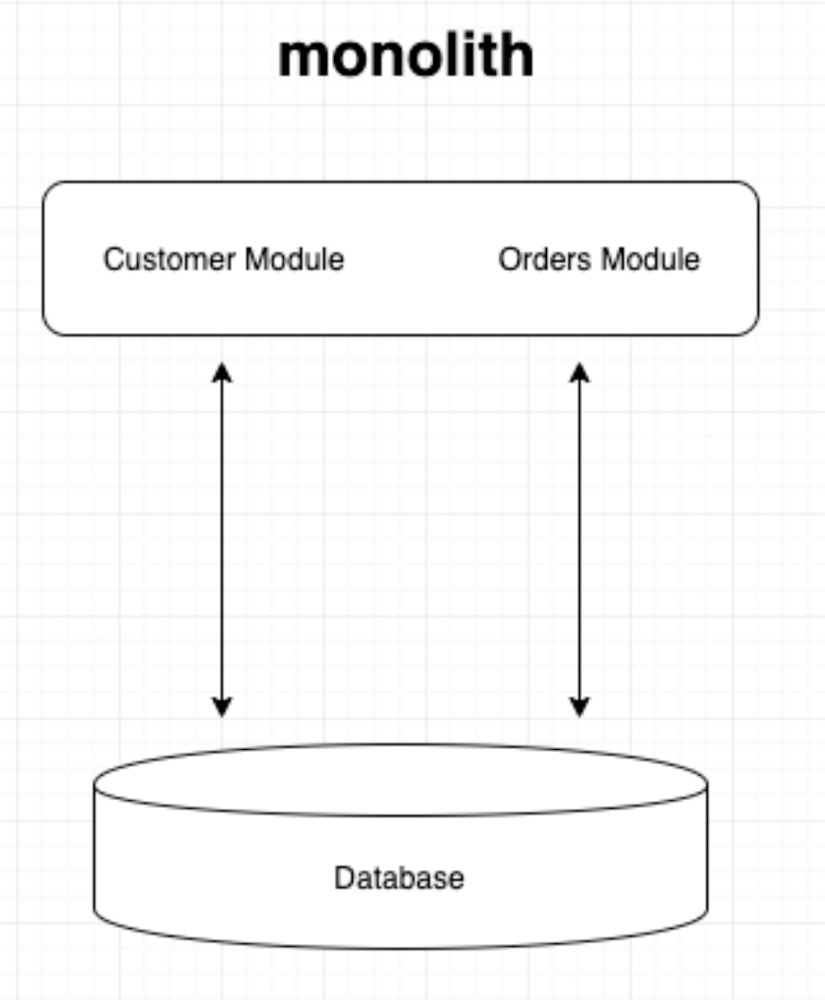

microservices：怎么做micro service，一般来说会把单体系统拆分；每个micro service会连着一个独立的db，micro service间不再共享db；
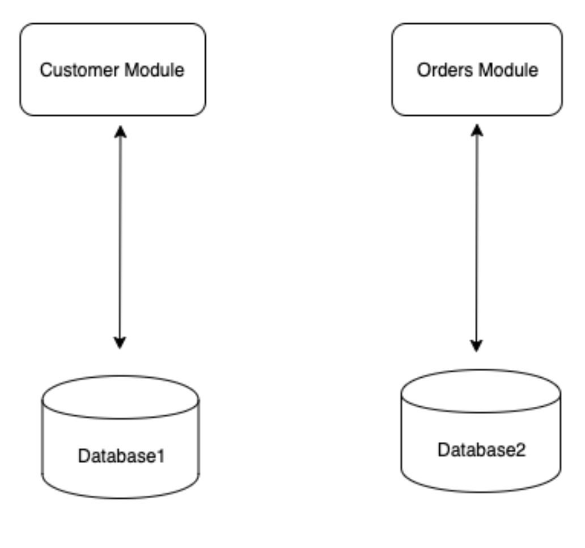

如果想实现module间的通信，需要引入消息队列（或者Restful API）
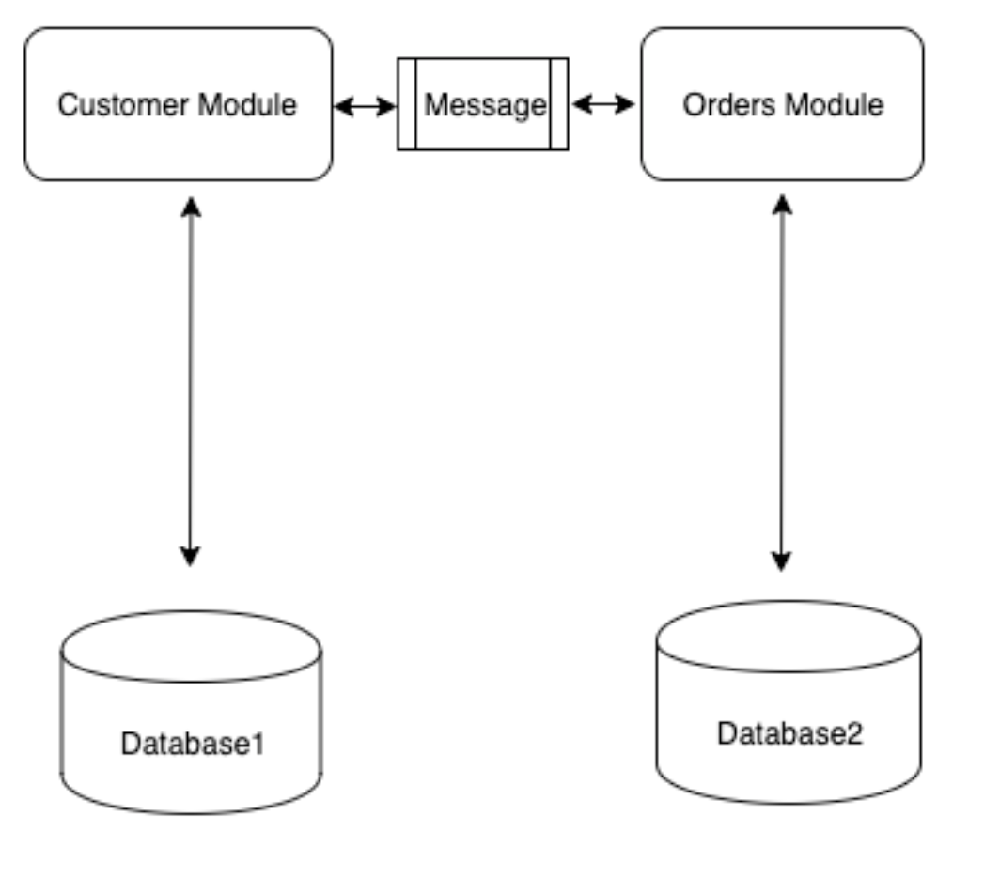

## 5.CAP原则
- C: Consistency
  - 数据一致性，单体系统可以保证；非单体系统，在引入message后，可以实现最终一致性
- A: Availability
  - 例如，设置三个zone，来实现region的high availabity
- P: Partition Tolerance
  - 三个zone，无法实现完全统一，要么实现CP，要么实现AP
  - CP：强力一致性，比如银行转账，必须要求双方转账金额同步，一方扣款，一方收款
  - AP：最终一致性，绝大部分场景下，我们的选择，比如我们发email，只要最终email发出就好，可能有延迟，但是要求没有那么高