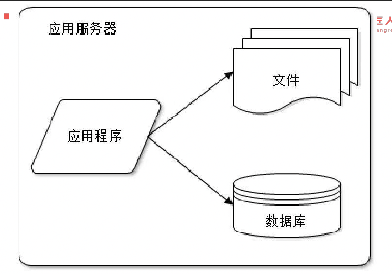
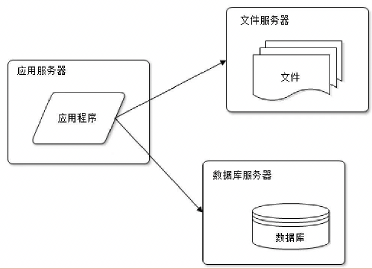
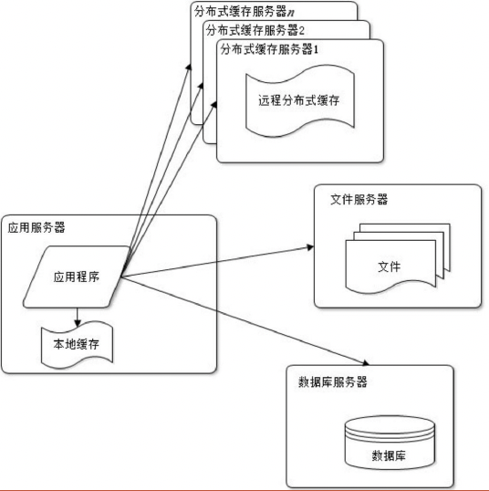
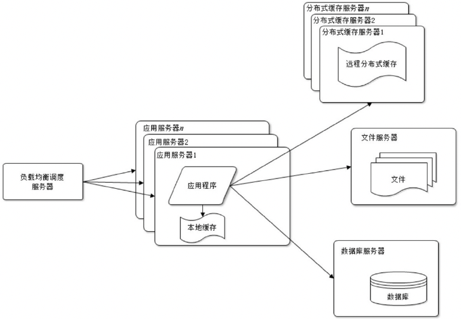
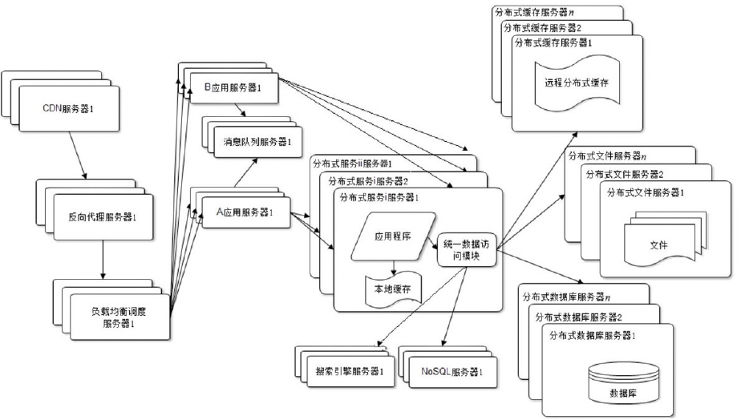
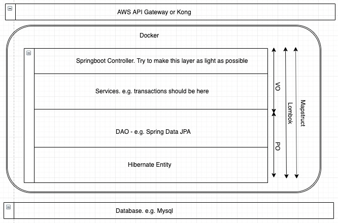
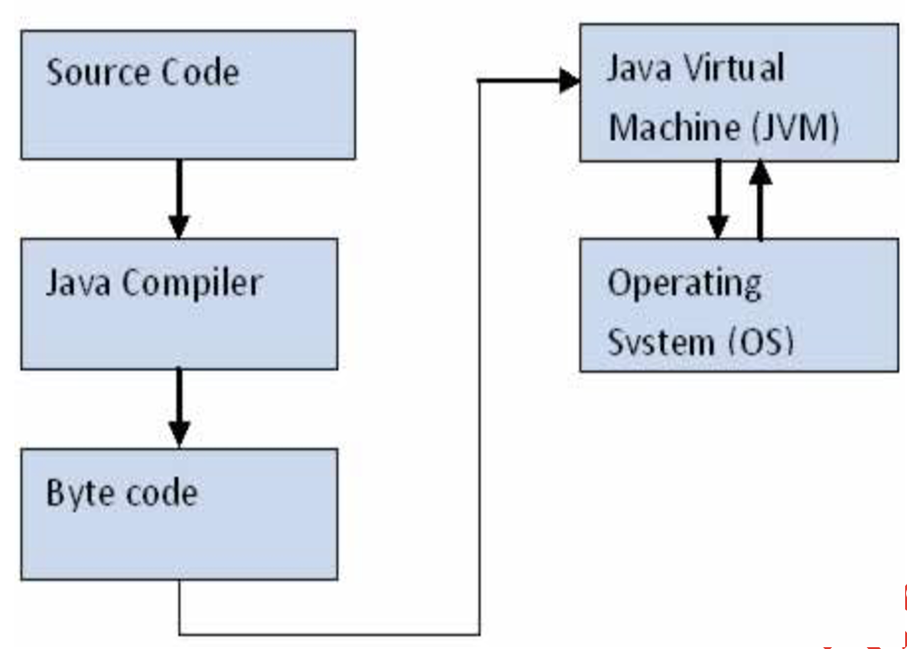
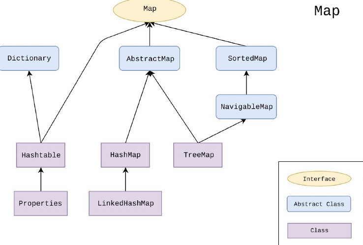
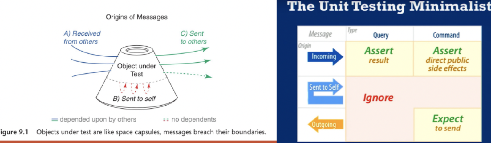
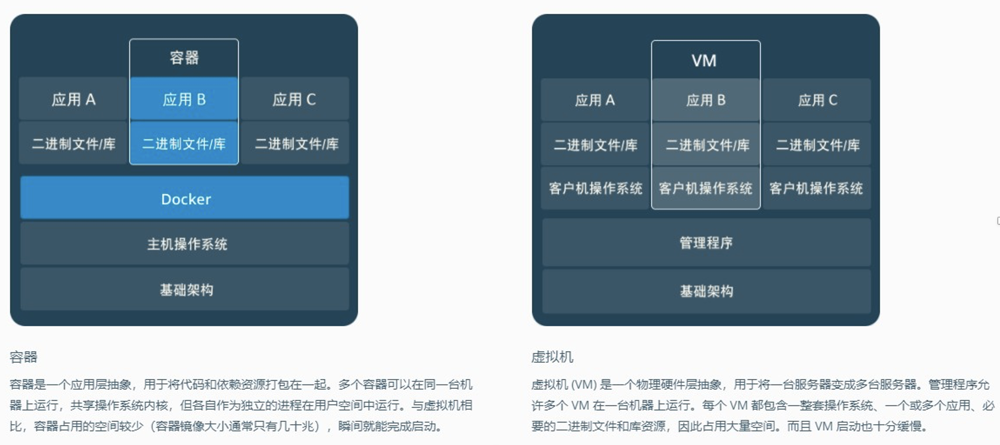

# JR_Web_FullStack14_Java_Note

## 主要知识点

### Java Backend
### Java Basic
### Spring Boot Introduction
### Spring Data JPA
### IOC AOP
### Docker
### Spring Security
### RESTful API
### Spring Security
### SQL

# 课堂笔记

## Java Backend

- 高可用
- 高性能
- 易扩展
- 可伸缩
- 且安全

- 好的互联网产品从来不是一开始就开发好的。而是不断演化而来的









### CAP Principle
C - Consistency 
A - Availability
P - Partition Tolerance
CAP原则又称CAP定理，指的是在一个分布式系统中，一致性（Consistency）、可用性（Availability）、分区容错性（Partition tolerance）。
CAP 原则指的是，这三个要素最多只能同时实现两点，不可能三者兼顾。

## Java Basic

### Java History
  - James Goslin created the Java in 1991.
  - Objected Oriented Programming language
  - Very very popular among the most popular language list
  - Easy to learn and easy to get hands dirty. Why? Garbage collection, JVM, Good IDE Support. Tons of Slack Overflow questions
  - Huge community. And a good language to understand OO as well
  - Comprehensive and powerful language supporting multi thread programming. NIO programming etc.
  - Android using Java, Kotlin
 
### Java Core
- OO Concept
  -	Polymorphism
  -	Encapsulation
  -	Composition
  -	Container (List, Set, Map)
  -	Generics (Diamond operator etc)

- Java 8 & Above
  - Lambda
  - Optional
  - Functional programming
  - Pass method as parameter
 
- Java Database
  -	ORM hibernate
  -	SQL
  -	Liquibase vs Flyway
  -	PostgreSQL
  -	H2

- Spring & Spring boot
  -	Spring data JPA
  -	Lombok
  -	MapStruct

- System integration
  - SAML Oauth2, JWT (gumtree)
  - Spring Security

### Environment
- Java 11
- IDEA
 
### How does Java work
- Compile Time. Using javac to class files
- Run Time.	Using java to run class files

 
### Java 参考资料
- JDK是最好的参考资料
- Google

### Variables and Types
Although Java is object oriented, not all types are objects. It is built on top of basic variable types called primitives.
Here is a list of all primitives in Java:
- byte
- short
- int
- long
- float
- double
- char
- boolean

### String
String probably is one of the most important object in Java.
- Immutable
- bear in mind always use equals to compare two strings if possible
- Familiar with String manipulations. indexOf, subString, concat, etc.
- Regular Expression

### Array
Array is another important data structure in almost any programming language
- Immutable
- Different type of arrays
- Familiar with Array manipulations.
 
### Conditions
- If else then
- Switch case break
- ? : operator
- Operators : == , !=, >, < ,&&, ||

### for Loop, 2 ways
- While Loop
- forEach. Java8
  for(data_type item : collection) { ... }
 
### Important concept in any languages
- Method signature includes the following:
  - Access modifiers. Public private protected
  - Return value
  - Parameters
  - passes the references by value
 
### Java Collections Framework - Collections
- A Java collection framework provides an architecture to store and manipulate a group of objects. A Java collection framework includes the following:
  - Interfaces
  - Classes
  - Algorithm: Algorithm refers to the methods which are used to perform operations such as searching and sorting, on objects that implement collection interfaces

 
### 序列列化和反序列列化
- I/O操作
- 对象序列列化：将对象以⼆二进制的形式保存在硬盘上或者进⾏行行⽹网络传输；
- 反序列列化：将⼆二进制的⽂文件/数据 转化为对象读取；
- 实现 serializable 接⼝口可以实现对象序列列化，其中没有需要实现的⽅方法，implements
Serializable 只是为了了标注该对象是可被序列列化的。
- 场景：⽂文件读写（Json，xml格式），⽹网络传输，数据库读写

### Java 8 Lambda
- A lambda expression is like syntactic sugar for an anonymous class with one method whose type is inferred. However, it will have enormous implications for simplifying development.

- The main syntax of a lambda expression is “parameters -> body”. The compiler can usually use the context of the lambda expression to determine the functional interface being used and the types of the parameters. There are four important rules to the syntax:
  - Declaring the types of the parameters is optional.
  - Using parentheses around the parameter is optional if you have only one parameter.
  - Using curly braces is optional (unless you need multiple statements).
  - The “return” keyword is optional if you have a single expression that returns a value.
   
### Java 8 Lambda
  ```
    () -> System.out.println(this)
    (String str) -> System.out.println(str) 
    str -> System.out.println(str)
    (String s1, String s2) -> { return s2.length() - s1.length(); } 
    (s1, s2) -> s2.length() - s1.length()
  ```

### System.outJava 8 Stream	 
- Java 8 API添加了了⼀一个新的抽象称为流Stream，可以以⼀一种声明的⽅方式处理理数据。
Stream 使⽤用⼀一种类似⽤用 SQL 语句句从数据库查询数据的直观⽅方式来提供⼀一种对 Java 集合运算和表达的⾼高阶抽象。
- 这种⻛风格将要处理理的元素集合看作⼀一种流，  流在管道中传输，  并且可以在管道的节点上进⾏行行处理理， 比如筛选， 排序，聚合等。
- 元素流在管道中经过中间操作（intermediate operation）的处理理，最后由最终操作(terminal operation)得到前⾯面处理理的结果。
 	 
### Java 8 Stream
Stream（流）是⼀一个来⾃自数据源的元素队列列并⽀支持聚合操作
- 元素是特定类型的对象，形成⼀一个队列列。 Java中的Stream并不会存储元素，⽽而是按需计算
- 数据源 流的来源。 可以是集合，数组，I/O channel， 产⽣生器generator 等。
- 聚合操作 类似SQL语句句⼀一样的操作， 比如filter, map, reduce, find, match, sorted等。

和以前的Collection操作不同， Stream操作还有两个基础的特征：
- Pipelining:  中间操作都会返回流对象本⾝身。  这样多个操作可以串串联成⼀一个管道，  如同流式⻛风格（fluent  style）。  这样做可以对操作进行优化，  比如延迟执⾏行行(laziness)和短路路( short-circuiting)。
- 内部迭代： 以前对集合遍历都是通过Iterator或者For-Each的⽅方式, 显式的在集合外部进⾏行行迭代， 这叫做外部迭代。 Stream提供了了内部迭代的⽅方式， 通过访问者模式(Visitor)实现。
 
### Exception handling
- 异常机制，是指程序不正常时的处理理⽅方式。具体来说，异常机制提供了了程序退出的安 全通道。当出现错误后，程序执⾏行行的流程发⽣生改变，程序的控制权转移到异常处理理器。
  ```
    try {
    // 有可能抛出异常的代码
    } catch (Exception e) {
    // 异常处理理
    } finally {
    // ⽆无论是否捕获到异常都会执⾏行行的程序
    }
  ```

### Exception handling
- Throwable类是整个Java异常体系的超类，都有的异常类都是派⽣生⾃自这个类。包含Error和
Exception两个直接⼦子类。
- Error表⽰示程序在运⾏行行期间出现了了⼗十分严重、不可恢复的错误，在这种情况下应⽤用程序只能中⽌止运⾏行行，例例如JAVA虚拟机出现错误。在程序中不⽤用捕获Error类型的异常。⼀一般情况下，在程序中也不应该抛出Error类型的异常。
- Exception是应⽤用层⾯面上最顶层的异常类，包含RuntimeException（运⾏行行时异常）和 Checked Exception（受检异常）。
  - RuntimeException是⼀一种Unchecked Exception，即表⽰示编译器不会检查程序是否对
RuntimeException作了了处理理，在程序中不必捕获RuntimException类型的异常，也不必在⽅方法     体声明抛出RuntimeException类。⼀一般来说，RuntimeException发⽣生的时候，表⽰示程序中出现了了编程错误，所以应该找出错误修改程序，⽽而不是去捕获RuntimeException。常⻅见的
RuntimeException有NullPointException、ClassCastException、IllegalArgumentException、IndexOutOfBoundException等。
  - Checked Exception是相对于Unchecked Exception⽽而⾔言的，所有继承⾃自Exception并且不是
RuntimeException的异常都是Checked Exception。JAVA 语⾔言规定必须对checked Exception 作处理理，编译器会对此作检查，要么在⽅方法体中声明抛出checked Exception，要么使⽤用catch 语句句捕获checked Exception进⾏行行处理理，不然不能通过编译。常⽤用的Checked Exception有
IOException、ClassNotFoundException等。
 
### 正确的Exception handling
原则性问题-异常处理理机制初衷：
1.将不可预期异常的处理理代码和正常的业务逻辑处理理代码分离。
2.异常只应该⽤用于处理理非正常情况，不要⽤用异常处理理来代替正常流程控制。（对于完全可知的、处理理⽅方式清晰的错误，程序本应该提供相应的错误代码，⽽而不是笼统称为异常）
3.先捕获⼩小异常，再捕获⼤大异常（Exception e ⽤用此表⽰示未知异常）
4.对于完全已知的错误应该编写处理理这种错误的代码，增加程序健壮性。
企业应⽤用做法：程序先捕获原始异常，然后抛出⼀一个新的业务异常，新的业务异常中包含对⽤用户的提⽰示信息	这种做法叫异常转译。因为核⼼心是：在合适的层级处理理异常。
 
### Log
- In production, do not use System.out as log tool
- Log4j, logback
- Use log configuration
- And suggest to use slf4j: slf4j是⼀一套包装Logging 框架的界⾯面程式， 以外观模式实现。可以在软件部署的时候决定要使⽤用的  Logging  框架，⽬目前主要⽀支援的有Java Logging API、log4j及logback等框架。https://zh.wikipedia.org/wiki/SLF4J
- Log应该包含什什么内容？	Debug log，interface log…
- ⽣生产环境的中的log到底在哪⾥里里？
 
### 单元测试


## Spring Boot Introduction

### 背景
- 从 Spring 说起，2000 年左右 Java 行业中都是 EJB 的天下， 但是 EJB 本身比较庞大复杂，各企业使用起来并不是很便利。
- Rod Johnson认为企业开发应该更简单，没有必要全部使用EJB，企业开发应该是一个统一的、高效的方式构造整个应用， 并且可以将单层框架以最佳的组合揉和在一起建立一个连贯的体系。
- Rod Johnson 2002 年编写了Expert One-on-One J2EE Design and Development》。这本书是Rod Johnson的成名著 作 ， 非 常 经 典 ， 从 这 本 书 中 的 代 码 诞 生 了 S p r i n g Framework。
- Spring 在不断发展的过程中也出现了一些问题，随着 Spring 边界不断扩张，需要的配置文件也越来越多，使用起来也越复杂， 项目中也经常因为配置文件配置错误产生很多问题。慢慢Spring  变成了一个大而全的框架，背离它简洁开发的理念。随着微服务的概念兴起， Spring 开发了一个全新的技术栈： Spring Boot。
 
### Spring Boot
Spring Boot 是由 Pivotal 团队提供的全新框架，其设计⽬目的是⽤用来简化新 Spring 应⽤用的初始搭建以及开发过程。该框架使⽤用了了特定的⽅方式来进⾏行行配置，从⽽而使开发⼈人员不再需要         定义样板化的配置。采⽤用 Spring Boot 可以⼤大⼤大的简化开发模式，所有你想集成的常⽤用框架，它都有对应的组件⽀支持。

https://spring.io/projects/spring-boot 官网介绍：
Spring Boot makes it easy to create stand-alone, production-grade Spring based Applications that you can "just run".
We take an opinionated view of the Spring platform and third-party libraries so you can get started with minimum fuss. Most Spring Boot applications need very little Spring configuration.
 
Spring Boot 是⼀一套全新的框架，它来⾃自于 Spring ⼤大家族，因此 Spring 所有具备的功能它都有，⽽而且更更容易易使⽤用；Spring Boot 以约定⼤大于配置的核⼼心思想，默认帮我们进⾏行行了了很多设置，多数 Spring Boot 应⽤用只需要很少的 Spring 配置。Spring Boot 开发了了很多的应⽤用集成包，⽀支持绝⼤大多数开源软件，让我们以很低的成本去集成其他主流开源软件。

Spring Boot 特性
- 使⽤用 Spring 项⽬目引导⻚页⾯面可以在⼏几秒构建⼀一个项⽬目
- ⽅方便便对外输出各种形式的服务，如 REST API、WebSocket、Web、Streaming、Tasks
- 非常简洁的安全策略略集成
- ⽀支持关系数据库和非关系数据库
- ⽀支持运⾏行行期内嵌容器，如 Tomcat、Jetty
- 强⼤大的开发包，⽀支持热启动
- ⾃自动管理理依赖
- ⾃自带应⽤用监控
- ⽀支持各种 IED，如 IntelliJ IDEA 、NetBeans
 
### 为什么学习Spring Boot
- 从软件发展的⾓角度来讲，越简单的开发模式越会流⾏行行。简单的开发模式解放出更更多⽣生   产⼒力力，让开发⼈人员可以将精⼒力力集中在业务上，⽽而不是各种配置、语法所设置的⻔门槛上。Spring Boot 就是尽可能的简化应⽤用开发的⻔门槛。
- Spring Boot 所集成的技术栈，⼏几乎都是各互联⽹网公司在使⽤用的技术，按照 Spring
Boot 的路路线去学习，基本可以了了解国内外互联⽹网公司的技术特点。
- Spring Boot 和微服务架构都是未来软件开发的⼀一个⼤大趋势，越早参与其中受益越⼤大。
 
### 开始第⼀一个项⽬目
  - 访问 SPRING INITIALIZR http://start.spring.io/。
  - 选择构建⼯工具 Gradle, Spring Boot 版本 2.1.1 及⼀一些⼯工程基本信息，可参考下图

### com.company.project 目录下：
- ProjectNameApplication.java：建议放到根目录下面，是项目的启动类，Spring Boot 项目只能有一个 main() 方法。
- util/comm：目录建议放置公共的类，如全局的配置文件、工具  类等。
- domain/model/entity：目录主要用于实体（Entity）与数据访问层（Repository）。
- repository：数据库访问层代码。
- service：该层主要是业务类代码。
- web/controller：该层负责页面访问控制。
- factory, handler, builder⋯
- resources 目录下：
  - static：目录存放 Web 访问的静态资源，如 JS、CSS、图片等。
  - templates：目录存放页面模板。
  - application.properties：项目的配置信息。
- test ⽬目录存放单元测试的代码


## Spring Data JPA
- 对象关系映射（Object Relational  Mapping，简称  ORM）模式是⼀一种为了了解决⾯面向对象与关系数据库存在的互不匹配的现象技术。简单的说，ORM 是通过使⽤用描述对象和数据库之间映射的元数据，将程序中的对象⾃自动持久化到关系数据库中
- 当开发⼀一个应⽤用程序的时候（不使⽤用 O/R  Mapping），你可能会写不少数据访问层的代码，⽤用来从数据库保存、删除、读取对象信息等。在 DAL 中写了了很多的⽅方法来读取对象数据、改变状态对象等任务，⽽而这些代码写起来总是重复的。 针对这些问题
ORM 提供了了解决⽅方案，简化了了将程序中的对象持久化到关系数据库中的操作。
- ORM 框架的本质是简化编程中操作数据库的编码，在 Java 江湖中发展到现在基本上就剩两家，⼀一个是宣称可以不⽤用写⼀一句句 SQL 的 Hibernate，⼀一个是以动态 SQL ⻅见⻓长的MyBatis，两者各有特点。在企业级系统开发中可以根据需求灵活使⽤用，发现⼀一个有趣的现象：传统企业⼤大都喜欢使⽤用 Hibernate，⽽而互联⽹网⾏行行业通常使⽤用 MyBatis。
- JPA（Java Persistence API）是 Sun 官⽅方提出的 Java 持久化规范，它为 Java 开发
⼈人员提供了了⼀一种对象/关联映射⼯工具来管理理 Java 应⽤用中的关系数据，它的出现主要是为了了简化现有的持久化开发⼯工作和整合 ORM 技术，结束现在 Hibernate、TopLink、
- JDO 等 ORM 框架各⾃自为营的局⾯面。值得注意的是，JPA 是在充分吸收了了现有
Hibernate、TopLink、JDO 等 ORM 框架的基础上发展⽽而来的，具有易易于使⽤用、伸缩性强等优点。从⽬目前的开发社区的反应上看，JPA 受到了了极⼤大的⽀支持和赞扬，其中就包括了了 Spring 与 EJB3.0 的开发团队。
- 注意：JPA 是⼀一套规范，不是⼀一套产品，像  Hibernate、TopLink、JDO  他们是⼀一套产品，如果说这些产品实现了了这个 JPA 规范，那么我们就可以叫他们为 JPA 的实现产品。
 
### Spring	Data	JPA
- Spring Data JPA 是 Spring 基于 ORM 框架、JPA 规范的基础上封装的⼀一套 JPA 应⽤用框架，可使开发者⽤用极简的代码即可实现对数据的访问和操作。它提供了了包括增、删、改、查等在内的常
⽤用功能，且易易于扩展。学习并使⽤用 Spring Data JPA 可以极⼤大提高开发效率。
- Spring Data JPA 让我们解脱了了 DAO 层的操作，基本上所有CRUD 都可以依赖于它来实现。

- 添加依赖：
  ```
    compile('org.springframework.boot:spring-boot-starter-data-jpa') 
    compile('mysql:mysql-connector-java') 
    compile('org.apache.commons:commons-lang3:3.1')
  ```
- 添加配置⽂文件：
  ```
    Spring.datasource.url=jdbc:mysql://localhost:3306/test 
    Spring.datasource.username=root 
    Spring.datasource.password=root
    Spring.datasource.driver-class-name=com.mysql.jdbc.Driver

    Spring.jpa.properties.hibernate.hbm2ddl.auto=update 
    Spring.jpa.properties.hibernate.dialect=org.hibernate.dialect.MySQL5InnoDBDialect 
    Spring.jpa.show-sql= true
  ```

- 添加配置⽂文件： hibernate.hbm2ddl.auto 参数的作⽤用主要⽤用于：⾃自动创建|更更新|验证数据库表结构，有四个值：
  - create：每次加载 hibernate 时都会删除上⼀一次的⽣生成的表，然后根据你的 model 类再重新来⽣生成新表，哪怕两次没有任何改变也要这样执⾏行行，这就是导致数据库表数据丢失的⼀一个重要原因。
  - create-drop ：每次加载 hibernate 时根据 model 类⽣生成表，但是 sessionFactory ⼀一关闭，表就
⾃自动删除。
  - update：最常⽤用的属性，第⼀一次加载 hibernate 时根据 model  类会⾃自动建立起表的结构（前提是先建立好数据库），以后加载 hibernate 时根据 model类⾃自动更更新表结构，即使表结构改变了了， 但表中的⾏行行仍然存在，不会删除以前的⾏行行。要注意的是当部署到服务器后，表结构是不会被⻢马上建立起来的，是要等应⽤用第⼀一次运⾏行行起来后才会。
  - validate ：每次加载 hibernate 时，验证创建数据库表结构，只会和数据库中的表进⾏行行比较，不会创建新表，但是会插入新值。
- dialect 主要是指定⽣生成表名的存储引擎为 InnoDB；
- show-sql 是否打印出⾃自动⽣生产的 SQL，⽅方便便调试的时候查看。
 
### 基本查询
- 基本查询也分为两种，一种是 Spring Data 默认已经实现，一种是根据查询的方法来自动解析成 SQL。

- 复杂查询
在实际的开发中需要⽤用到分⻚页、筛选、连表等查询的时候就需要特殊的⽅方法或者⾃自定义SQL。

- ⾃自定义 SQL 查询
使用 Spring Data 大部分的 SQL 都可以根据方法名定义的方式来实现，但是由于某些原因我们想使用自定义的 SQL 来查询，Spring Data 也可以完美支持；在SQL的查询方法上面使用  @Query 注解，如涉及到删除和修改需要加上  @Modifying。也可以根据需要添加  @Transactional对事物的支持，查询超时的设置等。

- 多表查询
多表查询在 Spring Data JPA 中有两种实现⽅方式，第⼀一种是利利⽤用 Hibernate 的级联查询来实现， 第⼆二种是创建⼀一个结果集的接⼝口来接收连表查询后的结果，这⾥里里主要使⽤用第⼆二种⽅方式。
特别注意这里的 SQL 是 HQL，需要写类的名和属性
 
- More
使用枚举的时候，如果选择数据库中存储的是枚举对应的 String 类型，而不是枚举的索引值，需要在属性上面添加
@Enumerated(EnumType.STRING) 注 解 ：
  ``` 
    @Enumerated(EnumType.STRING) 
    @Column(nullable = true)
    private UserStatus status;
  ```

不需要和数据库映射的属性
正常情况下实体类上加入注解	@Entity，就会让实体类和表相关连，如果其中某个属性我们不需要和数据库来关联只是在展示的时候做计算，只需要加上 @Transient 属性既可。
```
@Transient
private String fullName;
@Transient private int age;
```

### 连接多个数据源
在项目开发中，常常需要在一个项目中使用多个数据源，因此需要配置 Spring Data JPA 对多数据源的使用，一般分为以下三步：
- 配置多数据源
- 不同源的 repository 放入不同包路径
 
- SQL注入是比较常⻅见的⽹网络攻击⽅方式之⼀一，它不是利利⽤用操作系统的BUG来实现攻击，⽽而是针对程序员编程时的疏忽，通过SQL语句句，实现⽆无帐号登录，甚⾄至篡改数据库。
比如在⼀一个登录界⾯面，要求输入⽤用户名和密码： 可以这样输入实现免帐号登录：
⽤用户名： ‘or 1 = 1 --
密 码：
点登陆,如若若没有做特殊处理理,那么这个非法⽤用户可以登陆进去。从理理论上说，后台认证程序中会有如下的SQL语句句：
  ```
  String sql = "select * from user_table where username= ' "+userName+" ' and password=' "+password+" '";
  ```
当输入了了上⾯面的⽤用户名和密码，上⾯面的SQL语句句变成： 
  ```
  SELECT * FROM user_table WHERE username= '’or 1 = 1 -- and password='’
  ```

1.	永远不要信任⽤用户的输入，要对⽤用户的输入进⾏行行校验，可以通过正则表达式，或限制⻓长度，对单引号和双"-"进⾏行行转换等。
2.	永远不要使⽤用动态拼装SQL，使⽤用参数化的SQL或者直接使⽤用存储过程进⾏行行数据查询存取。
3.	永远不要使⽤用管理理员权限的数据库连接，为每个应⽤用使⽤用单独的权限有限的数据库连接。
4.	不要把机密信息明⽂文存放，请加密或者hash掉密码和敏感的信息。
5.	应⽤用的异常信息应该给出尽可能少的提⽰示，最好使⽤用⾃自定义的错误信息对原始错误信息进⾏行行包装，把异常信息存放在独立的表中。


## Spring IOC and AOP
### What is Inversion of Control?
Inversion of Control i a principle in software engineering and IoC enables a framework
to take control of the flow of a program and make calls to our custom code. To enable
this, frameworks use abstractions with additional behaviour built in. If we want to add
our own behaviour, we need to extend the classes of the framework or plugin our
own classes.
- The advantages of this architecture are:
  - decoupling the execution of a task from its implementation
  - making it easier to switch between different implementations
  - greater modularity of a pr gram
  - greater ease in testing a program by isolating a component or mocking its
  - dependencies and allowing components to communicate through contracts
IoC 主要的作⽤就是解耦各个组件，让⾼层模块不依赖底层模块，⽽是让两者依赖接⼝和
抽象来实现。Ioc的思想最核⼼的地⽅在于，资源不由使⽤资源的双⽅管理，⽽由不使⽤
资源的第三⽅管理，这可以带来很多好处。
1. 资源集中管理，实现资源的可配置和易管理。
2. 降低了使⽤资源双⽅的依赖程度，也就是我们说的耦合度。
 
### What is Dependency Injection?
- Dependency injection is a pattern through which to implement IoC, where the control
being inverted is the setting of object’s dependencies.
The act of connecting objects with other objects, or “injecting” objects into other objects,
is done by an assembler rather than by the objects themselves.
 
- DI and IoC work together
Downside of DI: management of dependencies is inconvenient
If we want to add another dependency to MyClass2, we have to change code by ourselves.
public class Main {
  public static void main(Str ng[] args) {
    MyClass4 myClass4 = new MyClass4();
    MyClass3 myClass3 = new MyClass3();
    MyClass2 myClass2 = new MyClass2(myClass3, myClass4);
    MyClass1 myClass1 = new MyClass1(myClass2);
    myClass1.doSomething();
  }
}
 
### DI and IoC work together
With IoC, the dependencies are managed by the container, and the programmer is relieved of that burden.Using annotations like @Autowired, the container is asked to inject a dependency where it is needed, and the programmers do not need to create/
manage those dependencies by themselves.
  ```
    public class MyClass2 {
      @Autowired
      private MyClass3 myClass3;
      @Autowired
      private MyClass4 myClass4;
      public void doSomething(){
        myClass3.doSomething();
        myClass4.doSomething();
      }
    }
  ```
 
### Spring开发的策略
Spring最根本的使命：简化Java开发。
为了降低Java开发的复杂性，Spring采取以下4种关键策略：
- 基于POJO的轻量级和最⼩侵入性编程
- 通过依赖注入和⾯向接⼝实现松耦合
- 基于切⾯和惯例进⾏声明式编程
- 通过切⾯和模版减少样板⽰代码
 
### IOC
IoC（Inversion of Control，控制倒转），是spring的核⼼，贯穿始终。所谓IoC，对于spring框架来说，就是由spring来负责控制对象的⽣命周期和对象间的关系。所有的类都会在spring容器中登记，告诉spring你是个什么，你需要什么，然后spring会在系统运⾏到适当的时候，把你要的东⻄主动给你，同时也把你交给其他需要你的东⻄。所有的类的创建、销毁都由 spring来控制，也就是说控制对象⽣存周期的不再是引⽤它的对象，⽽是spring。对于某个 体的对象⽽⾔，以前是它控制其他对象，现在是所有对象都被spring控制，所以这叫控制反转。
IoC 容器需要具备两个基本的功能：
- 通过描述管理 Bean，包括发布和获取 Bean；
- 通过描述完成 Bean 之间的依赖关系。
 
### The Spring IoC Container
Spring中将IoC容器管理的对象称为Bean，这个和JavaBean并没有什么关系。。
- BeanFactory：在 Spring 的定义中，它要求所有的 IoC 容器都需要实现接⼝BeanFactory，它是⼀个顶级容器接⼝。Bean⼯⼚，借助于配置⽂件能够实现对JavaBean的配置和管理，⽤于向使⽤者提供Bean的实例。
- ApplicationContext：ApplicationContext构建在BeanFactory基础之上，提供了更多的实⽤功能。 在现实中我们使⽤的⼤部分Spring IoC 容器是 ApplicationContext 接⼝的实现类
 
### 通过扫描装配Bean
- 如果⼀个个的 Bean 使⽤注解@Bean 注入 Sprin IoC 容器中，很⿇烦。 Spring 允许我们进⾏扫描装配 Bean 到 IoC 容器中，对于扫描装配⽽⾔使⽤的注解是@Component 和@ComponentScan。@Component 是标明哪个类被扫描进入 Spring IoC 容器，⽽@ComponentScan 则是标明采⽤何种策略去扫描装配 Bean。

### Setter-Based Dependency Injection
For setter-based DI, the container will call sett r methods of our class, after invoking a no-argument nstructor or no-argument static factory method to instantiate the bean. Let’s create t s configuration using annotations:
Constructor-based and setter-based types of injection can be combined for the same bean. The Spring documentation recommends using constructor-based injection for mandatory dependencies, and setter-based injection for optional ones.
 
### Field-Based Dependency Injection
- we can inject the dependencies by marking them with an @Autowired annotation
  ```
    public class Store {
    @Autowired
    private Item item;
    }
  ```
- While constructing the Store object, if there’s no constructor or setter meth d to inject the Item bean, the container will use reflection to inject Item into Store. This approach might look simpler and cleaner but is not recommended to use because it has a few drawbacks such as:
- This method uses reflection to inject the dependencies, which is costlier than constructor-based or setter-based injection
- It’s really easy to keep adding multiple dependencies using this approach. If you were using constructor injection having multiple arguments would have made us think that the class does more than one thing which can violate the Single Responsibility Principle.

### Autowired注解
@Autowired 的缺省规则：⾸先它会根据类型找到对应的 Bean，如果对应类型的 Bean 不是唯⼀的，那么它会根据其属性名称和 Bean 的名称进⾏匹配。如果匹配得上，就会使⽤该 Bean；如果还⽆法匹配，就会抛出异常。
 
### Autowired注解
- 消除歧义性——@Primary和@Quelifier
- @Primary 的含义告诉 Spring IoC 容器，当发现有多个同样类型的 Bean 时，请优先
使⽤这个进⾏注入
- @Qualifier 的配置项 value 需要⼀个字符串去定义，它将与@Autowired 组合在⼀起，
通过类型和名称⼀起找到 Bean。
 
### 带有参数的构造⽅法类的装配
使⽤@Autowired注解对构造⽅法的参数进⾏注入
  ```
    @Component
    public cla s BussinessPerson implements Person {
      private Animal animal = null;

      public BussinessPerson(@Autowired @Qualifier("dog") Animal
      animal) {
        this.animal = animal;
      }
      @Override
      public void service() {
        this.animal.use();
      }
      @Override
      public void setAnimal(Animal animal) {
        this.animal = animal;
      }
    }
  ```
 
### Bean 的⽣命周期的过程
- Spring IoC 初始化和销毁 Bean 的过程，这便是 Bean 的⽣命周期的过程，它⼤致分为 Bean 定义、Bean 的初始化、Bean 的⽣存期和 Bean 的销毁4个部分。
- Bean 定义过程⼤致如下：
  - Spring通过我们的配置，如@ComponentScan 定义的扫描路径去找到带有@Component 的类，这个过程就是⼀个资源定位的过程。
  - ⼀旦找到了资源，那么它就开始解析，并且将定义的信息保存起来。注意，此时还没有初始化 Bean，也就没有 Bean 的实例，它有的仅仅是 Bean 的定义。
  - 然后就会把定义发布到容器中。此时，IoC 容器也只有Bean的Bean

### Spring IoC
定义，还是没有 Bean 的实例⽣成。
- 完成了这3步只是⼀个资源定位并将 Bean 的定义发布到 IoC 容器的过程，还没Bean 实例的⽣成，更没有完成依赖注入。在默认的情况下，Spring 会继续去完成
Bean 的实例化和依赖注入，这样从 IoC 容器中就可以得到⼀个依赖注入完成的Bean。
 
### Bean 的初始化流程
- ComponentScan 中还有⼀个配置项 lazyInit，只可以配置 Boolean 值，且默认值为false，也就是默认不进⾏延迟初始化，因此在默认的情况下 Spring 会对 Bean 进⾏实例化和依赖注入对应的属性值。
 
### 使⽤属性⽂件
- 在 Spring Boot 中使⽤属性⽂件，可以采⽤其默的 application.properties，也可以使⽤⾃定义的配置⽂件。
  ```
    compileOnly "org.springframework.boot:spring-boot-configuration-processor"
    @Value("${database.driverName}")
    @ConfigurationProperties("database")
  ```

### 使⽤@Profile 指定不同环境
- 启动的时候选择选项 -Dspring.profiles.active 配置的值记为{profile}，则它会⽤application-{profile}.properties ⽂件去代替原来默认的 application.properties ⽂件，通过这样就能够有效地切换各类环境，如开发、测试和⽣产。
JAVA_OPTS="-Dspring.pr files.active=dev"
 
### AOP
- Aspect Oriented Programming
- ⾯向切⾯编程是⾯向对象编程的有益补充。aop是将那些与业务⽆关，却为业务模块所
共同调⽤的逻辑或责任进⾏封装。
- 应⽤AOP的功能举例：
Authentication 权限
Caching 缓存
Context passing 内容传递
Error handling 错误处理
Lazy loading　懒加载
Debugging　　调试


## Docker

### 定义
- Docker 是 Docker Inc 公司开源的⼀一项基于 Ubuntu LXC 技术之上构建的应⽤用打包运⾏行行时引擎，源代码托管在 GitHub 上，完全基于 Go 语⾔言开发并遵守Apache License 2.0 协议开源。
- Docker 是世界领先的软件容器平台。开发⼈人员利利⽤用 Docker 可以消除协作编码时“在我的
机器上可正常⼯工作”的问题。运维⼈人员利利⽤用 Docker 可以在隔离容器中并⾏行行运⾏行行和管理理应
⽤用，获得更更好的计算密度。企业利利⽤用  Docker   可以构建敏捷的软件交付管道，以更更快的速度、更更⾼高的安全性和可靠的信誉为 Linux 和 Windows Server 应⽤用发布新功能

### Docker技术解决的问题
- 复杂的环境配置管理理：从各种 OS 环境到各种中间件环境以及各种应⽤用环境。Docker 技术旨在简化部署多种应⽤用实例例环境依赖，如 Web 应⽤用、后台应⽤用、数据库应⽤用、⼤大数据应⽤用（例例如Hadoop集群）、消息队列列（例例如Kafka）等等都可以打包成⼀一个镜像部署。
- AWS 的成功，引导开发者将应⽤用转移到云上，解决了了硬件管理理的问题，然⽽而软件配置和管理理相关的问题依然存在（AWS Cloudformation提供相关功能）。Docker 的出现正好能帮助软件开发者开阔思路路，尝试新的软件管理理⽅方法来解决这个问题。
- 虚拟化⼿手段的变化：云时代采⽤用标配硬件来降低成本，采⽤用虚拟化⼿手段来满⾜足⽤用户按需  分配的资源需求以及保证可⽤用性和隔离性。然⽽而⽆无论是 KVM 还是 Xen，在 Docker 看来都在浪费资源，因为⽤用户需要的是⾼高效运⾏行行环境⽽而非 OS，GuestOS 既浪费资源⼜又难于管理理，轻量量级的 LXC 更更加灵活和快速。
- 容器技术的便便携性：LXC 在 Linux 2.6 的 Kernel ⾥里里就已经存在了了，但是其设计之初并非为云计算考虑的，缺少标准化的描述⼿手段和容器的可便便携性，决定其构建出的环境难于分发和标准化管理理

### 容器和虚拟机的区别
- 

### Docker的组成
- 客户端和服务器： Docker是⼀一个（C/S）架构的程序。Docker客户端只需向Docker服务器或者守护进程发出请求，服务器或者守护进程将完成所有的⼯工作并返回结果。Docker守护进程有时也称为Docker引擎。
- 镜像（Image）：镜像就是程序运⾏行行的环境的只读版本。其包含了了所有程序的依赖软件和配置。
- 容器：Docker 利利⽤用容器（Container）来运⾏行行应
⽤用。容器是从镜像创建的运⾏行行实例例。它可以被启 动、开始、停⽌止、删除。每个容器都是相互隔离的、保证安全的平台。可以把容器看做是⼀一个简易易版的 Linux 环境（包括root⽤用户权限、进程空间、⽤用户空间和⽹网络空间等）和运⾏行行在其中的应
⽤用程序
- 仓库Repository：仓库⽤用来保存镜像，可以理理解为代码控制中的代码仓库。

### Docker命令实战（功能划分和命令）
- 环境信息相关	1. info 2. version
- 系统运维相关	1. attach 2. build 3. commit 4. cp 5. diff 6. images 7. export/ import / save
/ load 8. inspect 9. kill 10. port 11. pause / unpause 12. ps 13. rm 14. rmi
1.  run 16. start / stop / restart 17. tag 18. top 19.wait 20. rename 21.stats 22. update 23. exec 24.deploy 25.create
- ⽇日志信息相关	1. events 2. history 3. logs
- Docker Hub服务相关	1. login/ logout 2. pull / push 3. search
- docker -D info	docker version	批量量打印出⽇日志：	docker logs
- 在运⾏行行中的容器运⾏行行命令：
docker exec [OPTIONS] CONTAINER COMMAND [ARG...]
 
### 用Docker打包Springboot 程序
- 生出⼀一个简单的程序
  ```
  @RestController
  public class SimpleController { 
    @GetMapping
    public final String hello() throws UnknownHostException { 
      return "Hello! Simple test for docker " +
    InetAddress.getLocalHost().getHostAddress();
    }
  }
  ```

### 用Docker打包Springboot 程序
- 用 Dockerfile定义image
  ```
  FROM openjdk:8-jdk-alpine
  COPY ./build/libs/docker-demo-0.0.1-SNAPSHOT.jar /usr/src/hello/ WORKDIR /usr/src/hello
  EXPOSE 8080
  CMD ["java", "-jar", "docker-demo-0.0.1-SNAPSHOT.jar"]
  ```

- 启动docker之后，命令⾏行行运⾏行行： docker build -t docker-test-demo .
- 查看⽣生成的docker image： docker images
- 启动应⽤用程序的container： docker run -p 8080:8080 docker-test-demo http://localhost:8080/hello

### docker-compose
- Docker Compose是⼀一个编排多容器分布式部署的⼯工具，提供命令集管理理容器化应⽤用的完整开发周期，包括服务构建，启动和停⽌止。
Compose 中有两个重要的概念念：
  - 服务 ( service )：⼀一个应⽤用的容器，实际上可以包括若若⼲干运⾏行行相同镜像的容器实例例
  - 项⽬目 ( project )：由⼀一组关联的应⽤用容器组成的⼀一个完整业务单元，在 docker-compose.yml
⽂文件中定义。
- Compose 的默认管理理对象是项⽬目，通过⼦子命令对项⽬目中的⼀一组容器进⾏行行便便捷地⽣生命周期管理理。可⻅见，⼀一个项⽬目可以由多个服务（容器）关联⽽而成， Compose ⾯面向项⽬目进⾏行行管理理

## Spring Security

## RESTful API

### RESTful	Web	Services
REST stands for REpresentational State Transfer. REST is a web standards based architecture and uses HTTP Protocol for data communication. It revolves around resources where every component is a resource and a resource is accessed by a common interface using HTTP standard methods. REST was first introduced by Roy Fielding in year 2000.

In REST architecture, a REST Server simply provides access to resources and the REST client accesses and presents the resources. Here each resource is identified by URIs/ Global IDs. REST uses various representations to represent a resource like Text, JSON and XML. JSON is now the most popular format being used in Web Services.

RESTful Web Services are basically REST Architecture based Web Services. In REST Architecture everything is a resource. RESTful web services are light weight, highly scalable and maintainable and are very commonly used to create APIs for web-based applications.

### REST Features
-	Resource
-	Messages
-	Addressing
-	Methods
-	Stateless
-	Caching
-	Security

### Resources
REST architecture treats every content as a resource. These resources can be Text Files, Html Pages, Images, Videos or Dynamic Business Data. REST Server simply provides access to resources and REST client accesses and modifies the resources. Here each resource is identified by URIs/ Global IDs. REST uses various representations to represent a resource where Text, JSON, XML. The most popular representations of resources are XML and JSON.
Representation of Resources XML, JSON, HTML etc.
  ```
    <user>
    <id>1</id>
    <name>Mahesh</name>
    <profession>Teacher</profession>
    </user>
    {
    "id":1,
    "name":"Mahesh", "profession":"Teacher"
    }
  ```

### Good Resources Representation
REST does not impose any restriction on the format of a resource representation. A client can ask for JSON representation whereas another client may ask for XML representation of the same resource to the server and so on.
Understandability − Both the Server and the Client should be able to understand and utilize the representation format of the resource.

Completeness − Format should be able to represent a resource completely. For example, a resource can contain another resource. Format should be able to represent simple as well as complex structures of resources.

Linkablity − A resource can have a linkage to another resource, a format should be able to handle such situations.

Verb − Indicates the HTTP methods such as GET, POST, DELETE, PUT, etc.

URI − Uniform Resource Identifier (URI) to identify the resource on the server.

HTTP Version − Indicates the HTTP version. For example, HTTP v1.1.

Request Header − Contains metadata for the HTTP Request message as key-value pairs. For example, client (or browser) type, format supported by the client, format of the message body, cache settings, etc.

Request Body − Message content or Resource representation.

Status/Response Code − Indicates the Server status for the requested resource. For example, 404 means resource not found and 200 means response is ok.

HTTP Version − Indicates the HTTP version. For example HTTP v1.1.

Response Header − Contains metadata for the HTTP Response message as key value pairs. For example, content length, content type, response date, server type, etc.

Response Body − Response message content or Resource representation.

### Chrome developer Tools
- Addressing refers to locating a resource or multiple resources lying on the server. It is analogous to locate a postal address of a person.
- Constructing a Standard URI
  - Use Plural Noun − Use plural noun to define resources.

  - Avoid using spaces − Use underscore (_) or hyphen (-) when using a long resource name. For example, use authorized_users instead of authorized%20users.

  - Use lowercase letters − Although URI is case-insensitive, it is a good practice to keep the url in lower case letters only.

  - Maintain Backward Compatibility − As Web Service is a public service, a URI once made public should always be available. In case, URI gets updated, redirect the older URI to a new URI using the HTTP Status code, 300.

- Use HTTP Verb − Always use HTTP Verb like GET, PUT and DELETE to do the operations on the resource. It is not good to use operations name in the URI.

### The following HTTP methods are most commonly used in a REST based architecture.
- GET − Provides a read only access to a resource.
- POST − Used to create a new resource.
- PUT − Used to update an existing resource or create a new resource.
- DELETE − Used to remove a resource.
- OPTIONS − Used to get the supported operations on a resource.

### Statelessness
- As per the REST architecture, a RESTful Web Service should not keep a client state on the server. This restriction is called Statelessness. It is the responsibility of the client to pass its context to the server and then the server can store this context to process the client's further request. For example, session maintained by server is identified by session identifier passed by the client.
  ```
    <book>
    <id>1</id>
    <name>Game of throne</name>
    </book>
  ```
Stateless means every time, you hit the RESTful Service, it should return the same value, regardless the State of the user journey.

### Statelessness Pros vs Cons
- Pros:
  - Web services can treat each method request independently.
  - Web	services	need	not	maintain	the	client's	previous	interactions.	It	simplifies	the application design.
  - As HTTP is itself a statelessness protocol, RESTful Web Services work seamlessly with the HTTP protocols.

- Cons
  - Web services need to get extra information in each request and then interpret to get the client's state in case the client interactions are to be taken care of.

- Solutions
  - Server Side Session, Business Process Engine in the background etc.

Caching refers to storing the server response in the client itself, so that a client need not make a server request for the same resource again and again. A server response should have information about how caching is to be done, so that a client caches the response for a time- period or never caches the server response.

### swagger2 

- 接口非常多，细节又复杂，如果由程序员⾼高质量量的输出一个⽂文档，经常耗时⻓而且效 果也不好，抱怨声不绝与耳。
- 随着时间的推移，文档需要与代码保持同步。但由于大部分程序员都还有着⽂档不重 要的思想，于是总有这样那样的原因导致程序员不愿意或遗忘了了更新文档。

Swagger 是一系列列 RESTful API 的⼯工具，通过 Swagger 可以获得⼀一种交互式⽂档，客户端 SDK 的⾃动⽣成等功能。
Swagger 的⽬标是为 REST APIs 定义⼀个标准的、与语⾔无关的接⼝，使人和计算机在看不到源码或者看不到⽂档或者不能通过⽹络流量检测的情况下，能发现和解各种服务的功能。当服务通过 Swagger 定义，消费者就能与远程的服务互动通过少量的实现逻辑。类似于低级编程接⼝，Swagger去掉了调用服务时的很多猜测。
 
### GraphQL
GraphQL 是⼀一个⽤用于API 的查询语⾔言，是
⼀一个使⽤用基于类型系统来执⾏行行查询的服务端运⾏行行时（类型系统由你的数据定义）。
GraphQL 并没有和任何特定数据库或者存储引擎绑定，⽽而是依靠你现有的代码和数据⽀支撑。

1.	Round-Trips are lesser in GraphQL
2.	Client Specific Queries
3.	Self Discoverable
4.	GraphQL is Hierarchical

### 其他接⼝口通信⽅方式
- RPC：远程过程调⽤用Remote Procedure Call
- Protocol: TCP, HTTP
- Format: xml, JSON, protocol buffer..
- Tools: Thrift, gPRC


## SQL

### 数据库
- Data Persistence
- Why?
- Compared with file
非关系型数据库(NoSQL)：MongoDB，LevelDB……
关系型数据库(SQL)：Sqlite，MySQL，PostgreSQL，SQL Server……
 
### 数据库表
- ⼀个数据库通常包含⼀个或多个表。每个表由⼀个名字标识（例如“客户”或者“订单”）。
- 表包含带有数据的记录（⾏）。 下⾯的例⼦是⼀个存个⼈信息的表：
 
### SQL
- 结构化查询语⾔ (SQL) 是⽤于访问SQL数据库的标准语⾔
- SQL 是⼀⻔ ANSI 的标准计算机语⾔，⽤来访问和操作数据库系统。
- SQL 语句⽤于取回和更新数据库中的数据。
- SQL 可与数据库程序协同⼯
- 存在着很多不同版本的 SQL 语⾔，但是为了与 ANSI 标准相兼容，它们必须以相似的⽅式共同地来⽀持⼀些主要的关键词（比如 SELECT、UPDATE、DELETE、INSERT、WHERE 等等）
- 除了 SQL 标准之外，⼤部分 SQL 数据库程序都拥有它们⾃⼰的私有扩展
 
### SQL语法
* SQL 对⼤⼩写不敏感！
* 某些数据库系统要求在每条 SQL 命令的末端使⽤分号。
分号是在数据库系统中分隔每条 SQL 语句的标准⽅法，这样就可以在对服务器的相
同请求中执⾏⼀条以上的语句。
* 可以分⾏
 
### 安装数据库
* Postgres docker version
* pgAdmin Client
 
### SQL 数据定义语⾔ (DDL)
- CREATE DATABASE 创建数据库
- CREATE TABLE 创建新表
- ALTER TABLE 变更（改变）数据库表
- DROP TABLE 删除表
- CREATE INDEX 创建索引（搜索键）
- DROP INDEX 删除索引

### CREATE DATABASE 语句
CREATE DATABASE ⽤于创建数据库。
SQL CREATE DATABASE 语法
CREATE DATABASE database_name
 
### CREATE TABLE 语句
CREATE TABLE 语句⽤于创建数据库中的表
SQL CREATE TABLE 语法
  ```
    CREATE TABLE 表名称
    (
    列名称1 数据类型,
    列名称2 数据类型,
    列名称3 数据类型,
    ....
    )
  ```
 
### CREATE TABLE 语句
- SQL 数据类型
- 数据类型（data_type）规定了列可容纳何种数据类型。
- 下⾯的表格包含了SQL中最常⽤的数据类型：

 
### CREATE TABLE 语句
SQL 约束
可以在创建表时规定约束（通过 CREATE TABLE 语句），或者在表创建之后也可以（通过 ALTER TABLE 语句）。
常⻅以下⼏种约束：
- NOT NULL： 不可为空
- UNIQUE：不可重复
- PRIMARY KEY：主键
- FOREIGN KEY：外键，⼀个表中的 FOREIGN KEY 指向另⼀个表中的
PRIMARY KEY（语法取决于数据版本）
- CHECK：值约束（语法取决于数据版本）
- DEFAULT：默认值
 
### CREATE TABLE 语句
创建⼀个价格历史数据表
CREATE TABLE "price_history" (
`ID` INTEG R PRIMARY KEY AUTOINCREMENT UNIQUE,
`datetime` INTEGER NOT NULL,
`exchange` TEXT,
`symb` TEXT,
`price` REAL
)
 
### CREATE INDEX 语句
创建索引
```sql
CREATE INDEX `datetime` ON `price_history` (`datetime` )
```
 
### SQL 数据操作语⾔ (DML)
- SELECT - 从数据库表中获取数据
- UPDATE - 更新数据库表中的数据
- DELETE - 从数据库表中删除数据
- INSERT INTO - 向数据库表中插入数据
 
### SELECT 语句
SELECT 语句⽤于从表中选取数据。
结果被存储在⼀个结果表中（称为结果集）。
语法
SELECT 列名称 FROM 表名称
以及：
SELECT * FROM 表名称
注释：SQL 语句对⼤⼩写不敏感。SELECT 等效于 select。
 
### SELECT 语句
SQL SELECT 实例
SELECT datetime, price FROM price_history
SQL SELECT * 实例
请使⽤符号 * 取代列的名称，就像这样：
SELECT * FROM price_history
 
### Limit 语句
SELECT * FROM price_history LIMIT 10
 
### SELECT DISTINCT 语句
在表中，可能会包含重复值。
关键词 DISTINCT ⽤于返回唯⼀不同的值。
语法：
SELECT DISTINCT 列名称 FROM 表名称
使⽤ DISTINCT 关键词
SELECT DISTINCT exchange FROM price_history
 
### WHERE ⼦句
SELECT * FROM pri e_history where exchange = 'OKCoin'
引号的使⽤
* SQL 使⽤单引号来环绕⽂本值（⼤部分数据库系统也接受双引号）
* 如果是数值，不要使⽤引号。
 
AND & OR 运算符
AND 和 OR 可在 WHERE ⼦语句中把两个或多个条件结合起来。
如果第⼀个条件和第⼆个条件都成立，则 AND 运算符显⽰⼀条记录。
如果第⼀个条件和第⼆个条件中只要有⼀个成立，则 OR 运算符显⽰⼀条记录。
 
SELECT * FROM price_history where exchange = 'OKCoin'
and datetime > 1510933571
SELECT * FROM price_history where exchange = 'OKCoin' or
exchange = 'Bitfinex'
结合 AND 和 OR 运算符
我们也可以把 AND 和 OR 结合起来（使⽤圆括号来组成复杂的表达式）:
SELECT * FROM price_history
where
(exchange = 'OKCoin' or exchange = 'Bitfinex')
and datetime > 1510933571
 
LIKE 操作符
LIKE 操作符⽤于在 WHERE ⼦句中搜索列中的指
定模式。
SQL LIKE 操作符语法
SELECT column_name(s)
FROM table_name
WHERE column_name LIKE pattern
 
SELECT * FROM price_history
where
symb like '%AUD'
SELECT * FROM price_history
where
symb not like '%AUD'
 
BETWEEN 操作符
操作符 BETWEEN ... AND 会选取介于两个值之间的数据范围。这些值可以是数值、⽂
本或者⽇期。
SQL BETWEEN 语法
SELECT column_name(s)
FROM table_name
WHERE column_name
BETWEEN value1 AND value2
 
WHERE ⼦句
SELECT * FROM price_history
where dat time
BETWEEN 1510933500 AND 1510933550
 
ORDER BY ⼦句
ORDER BY 语句⽤于根据指定的列对结果集进⾏排序。
ORDER BY 语句默认按照升序对记录进⾏排序。
如果希望按照降序对记录进⾏排序，可以使⽤ DESC 关键字。
 
ORDER BY ⼦句
SELECT * FROM price_history SELECT * FROM price_history
order by datetime
order by datetime, exchange
SELECT * FROM price_history
order by datetime DESC
SELECT * FROM price_history
order by datetime, exchange desc
 
INSERT INTO 语句
INSERT INTO 语句⽤于向表格中插入新的⾏。
语法
INSERT INTO 表名称 VALUES (值1, 值2,….)
我们也可以指定所要插入数据的列：
INSERT INTO table_name (列1, 列2,...) VALUES (值1, 值2,....)
 
INSERT INTO 语句
插入新的⾏
SQL 语句：
INSERT INTO exchange VALUES (1, 'Bitfinex', 'https://www.bitfinex.com/', '')
在指定的列中插入数据
SQL 语句：
INSERT INTO exchange (name,url) VALUES ('Bitstamp', 'https://www.bitstamp.net')
 
UPDATE 语句
Update 语句⽤于修改表中的数据。
语法：
UPDATE 表名称 SET 列名称 = 新值 WHERE 列名称 = 某值
 
更新某⼀⾏中的若⼲列
更新某⼀⾏中的⼀个列
UPDATE exchange
UPDATE exchange
SET url = 'https://
www.bitstamp.net/', comments = 'OK'
WHERE name = 'Bitstamp'
SET url = 'https://
www.bitstamp.net/'
WHERE name = 'Bitstamp'
 
DELETE 语句
DELETE 语句⽤于删除表中的⾏。
语法
DELETE FROM 表名称 WHERE 列名称 = 值
 
DELETE 语句
删除所有⾏
删除某⾏
可以在不删除表的情况下删除所有的⾏。这意味着表的结构、
属性和索引都是完整的：
DELETE FROM
exchange
WHERE
DELETE FROM table_name
或者：
ID = 3
DELETE * FROM table_name
 
SQL JOIN
引⽤两个表
SELECT *
FROM exchange, price_history
WHERE exchange.name = price_history.exchange
使⽤ Join
SELECT *
FROM price_history
INNER JOIN exchange
ON exchange.name = price_history.exchange
 
SQL JOIN
不同的 SQL JOIN
除了我们在上⾯的例⼦中使⽤的
INNER JOIN（内连接），我们还可
以使⽤其他⼏种连接。
- JOIN: 如果表中有⾄少⼀个匹
配，则返回⾏
- LEFT JOIN: 即使右表中没有匹
配，也从左表返回所有的⾏
- RIGHT JOIN: 即使左表中没有
匹配，也从右表返回所有的⾏
- FULL JOIN: 只要其中⼀个表中
存在匹配，就返回⾏
 
UNION 操作符
SQL UNION 操作符
UNION 操作符⽤于合并两个或多个 SELECT 语句的结果集。
请注意，UNION 内部的 SELECT 语句必须拥有相同数量的列。列也必须拥有相似
的数据类型。同时，每条 SELECT 语句中的列的顺序必须相同。
SQL UNION 语法
```sql
SELECT column_name(s) FROM table_name1
UNION
SELECT column_name(s) FROM table_name2
```
 
GROUP BY 语句
语法
⽤于结合合计函数，根据⼀个或多个列对结果集进⾏分组。
SELECT column_name, aggregate_function(column_name)
FROM table_name
WHERE column_name operator value
GROUP BY column_name
 
GROUP BY 语句
⽰例
```sql
SELECT *,COUNT(price) FROM price_history
GROUP BY exchange
```
不⽤GROUP BY会对所有⾏进⾏计算
```sql
SELECT *,COUNT(price) FROM price_history
```
 
GROUP BY 语句
计算平均
```sql
SELECT *,avg(price) FROM price_history
GROUP BY exchange, symb
```
 
HAVING ⼦句
在 SQL 中增加 HAVING ⼦句原因是，WHERE 关键字⽆法与合计函数结果⼀起使⽤。
记录超过30条的交易所
错误⽰例：
正确⽰范
```sql
```sql
SELECT *,COUNT(price) FROM SELECT *,COUNT(price) FROM
price_history
GROUP BY exchange
WHERE COUNT(price) > 30
```
price_history
GROUP BY exchange
HAVING COUNT(price) > 30
```
 
HAVING ⼦句
HAVING 语法
```sql
SELECT column_name, aggregate_function(column_name)
FROM table_name
WHERE column_name operator value
GROUP BY column_name
HAVING aggregate_function(column_name) operator value
```
 
事务（transaction）
应⽤：银⾏账户转账问题
1. 提出A-B转账需求：取100
2. 检查A账户余额：101
3. 余额充⾜
4. A账户余额设为101-100=1
5. <停电了>
6. B账户余额设为0+100=100
 
事务（transaction）
⼀组SQL命令
要么全都执⾏，要么全都不执⾏（原⼦性/Actomicity）
在事务开始和完成时，数据都必须保持⼀致状态（⼀致性/Consistent）
事务在不受外部并发操作影响的“独立”环境执⾏（隔离性/Isolation）
事务完成之后，它对于数据的修改是永久性的（持久性/Durable）
语法（注意参考具体数据库软件的⼿册）
BEGIN TRANSACTION;
<SQL1>;
<SQL2>;
<…………>;
COMMIT;
 
数据库设计
降低冗余，消除依赖
• <Project Name>部分依赖于主键中的<Project Number>
• <Employee Name>，<Salary Category>和<Salary package>都部分依赖于主键中的<Employee Number>
 
数据库设计
降低冗余，消除依赖